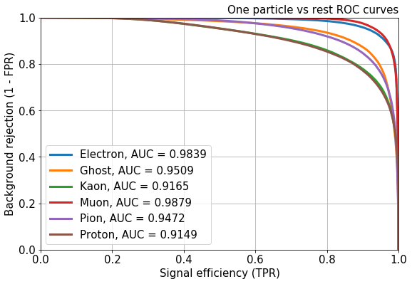
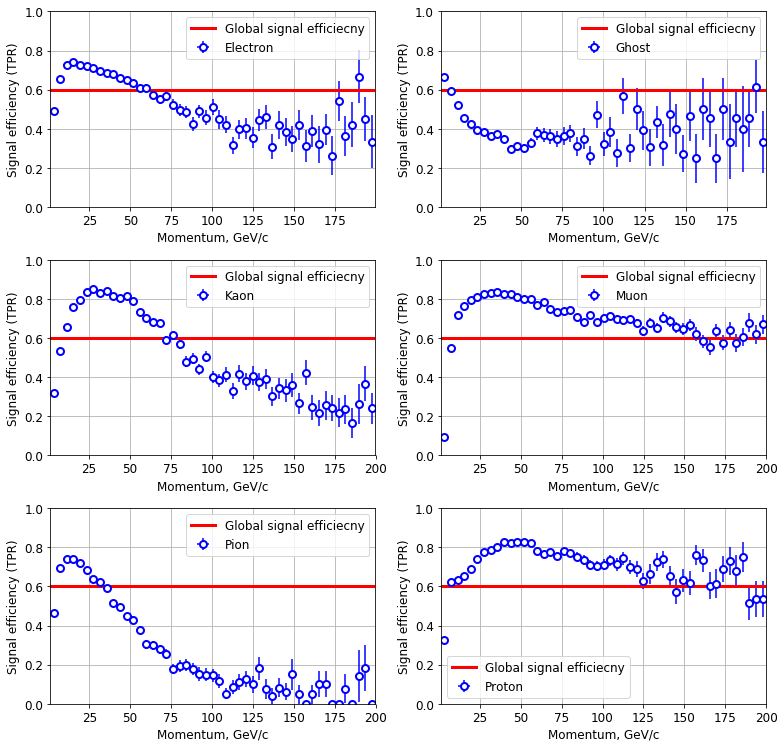
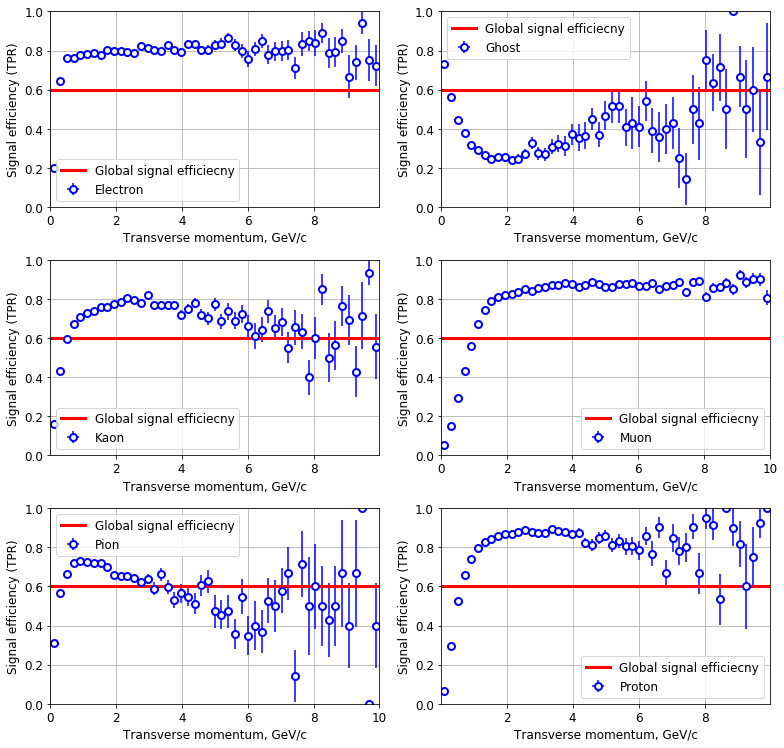

# About

In this programming assignment you will train a classifier to identify type of a particle. There are six particle types: electron, proton, muon, kaon, pion and ghost. Ghost is a particle with other type than the first five or a detector noise. 

Different particle types remain different responses in the detector systems or subdetectors. Thre are five systems: tracking system, ring imaging Cherenkov detector (RICH), electromagnetic and hadron calorimeters, and muon system.


You task is to identify a particle type using the responses in the detector systems.


```python
%matplotlib inline
import matplotlib.pyplot as plt
import pandas
import numpy
from sklearn.model_selection import train_test_split
from sklearn.metrics import log_loss
import utils
```

# Download data

Download data used to train classifiers.

### Read training file


```python
data = pandas.read_csv('training.csv.gz')
```


```python
data.head()
```


<div>
<style>
    .dataframe thead tr:only-child th {
        text-align: right;
    }

    .dataframe thead th {
        text-align: left;
    }

    .dataframe tbody tr th {
        vertical-align: top;
    }
</style>
<table border="1" class="dataframe">
  <thead>
    <tr style="text-align: right;">
      <th></th>
      <th>TrackP</th>
      <th>TrackNDoFSubdetector2</th>
      <th>BremDLLbeElectron</th>
      <th>MuonLooseFlag</th>
      <th>FlagSpd</th>
      <th>SpdE</th>
      <th>EcalDLLbeElectron</th>
      <th>DLLmuon</th>
      <th>RICHpFlagElectron</th>
      <th>EcalDLLbeMuon</th>
      <th>...</th>
      <th>TrackNDoF</th>
      <th>RICHpFlagMuon</th>
      <th>RICH_DLLbeKaon</th>
      <th>RICH_DLLbeElectron</th>
      <th>HcalE</th>
      <th>MuonFlag</th>
      <th>FlagMuon</th>
      <th>PrsE</th>
      <th>RICH_DLLbeMuon</th>
      <th>RICH_DLLbeProton</th>
    </tr>
  </thead>
  <tbody>
    <tr>
      <th>0</th>
      <td>74791.156263</td>
      <td>15.0</td>
      <td>0.232275</td>
      <td>1.0</td>
      <td>1.0</td>
      <td>3.2</td>
      <td>-2.505719</td>
      <td>6.604153</td>
      <td>1.0</td>
      <td>1.929960</td>
      <td>...</td>
      <td>28.0</td>
      <td>1.0</td>
      <td>-7.213300</td>
      <td>-0.280200</td>
      <td>5586.589846</td>
      <td>1.0</td>
      <td>1.0</td>
      <td>10.422315</td>
      <td>-2.081143e-07</td>
      <td>-24.824400</td>
    </tr>
    <tr>
      <th>1</th>
      <td>2738.489989</td>
      <td>15.0</td>
      <td>-0.357748</td>
      <td>0.0</td>
      <td>1.0</td>
      <td>3.2</td>
      <td>1.864351</td>
      <td>0.263651</td>
      <td>1.0</td>
      <td>-2.061959</td>
      <td>...</td>
      <td>32.0</td>
      <td>1.0</td>
      <td>-0.324317</td>
      <td>1.707283</td>
      <td>-0.000007</td>
      <td>0.0</td>
      <td>1.0</td>
      <td>43.334935</td>
      <td>2.771583e+00</td>
      <td>-0.648017</td>
    </tr>
    <tr>
      <th>2</th>
      <td>2161.409908</td>
      <td>17.0</td>
      <td>-999.000000</td>
      <td>0.0</td>
      <td>0.0</td>
      <td>-999.0</td>
      <td>-999.000000</td>
      <td>-999.000000</td>
      <td>0.0</td>
      <td>-999.000000</td>
      <td>...</td>
      <td>27.0</td>
      <td>0.0</td>
      <td>-999.000000</td>
      <td>-999.000000</td>
      <td>-999.000000</td>
      <td>0.0</td>
      <td>0.0</td>
      <td>-999.000000</td>
      <td>-9.990000e+02</td>
      <td>-999.000000</td>
    </tr>
    <tr>
      <th>3</th>
      <td>15277.730490</td>
      <td>20.0</td>
      <td>-0.638984</td>
      <td>0.0</td>
      <td>1.0</td>
      <td>3.2</td>
      <td>-2.533918</td>
      <td>-8.724949</td>
      <td>1.0</td>
      <td>-3.253981</td>
      <td>...</td>
      <td>36.0</td>
      <td>1.0</td>
      <td>-35.202221</td>
      <td>-14.742319</td>
      <td>4482.803707</td>
      <td>0.0</td>
      <td>1.0</td>
      <td>2.194175</td>
      <td>-3.070819e+00</td>
      <td>-29.291519</td>
    </tr>
    <tr>
      <th>4</th>
      <td>7563.700195</td>
      <td>19.0</td>
      <td>-0.638962</td>
      <td>0.0</td>
      <td>1.0</td>
      <td>3.2</td>
      <td>-2.087146</td>
      <td>-7.060422</td>
      <td>1.0</td>
      <td>-0.995816</td>
      <td>...</td>
      <td>33.0</td>
      <td>1.0</td>
      <td>25.084287</td>
      <td>-10.272412</td>
      <td>5107.554680</td>
      <td>0.0</td>
      <td>1.0</td>
      <td>0.000015</td>
      <td>-5.373712e+00</td>
      <td>23.653087</td>
    </tr>
  </tbody>
</table>
<p>5 rows × 50 columns</p>
</div>


### List of columns in the samples

Here, **Spd** stands for Scintillating Pad Detector, **Prs** - Preshower, **Ecal** - electromagnetic calorimeter, **Hcal** - hadronic calorimeter, **Brem** denotes traces of the particles that were deflected by detector.

- ID - id value for tracks (presents only in the test file for the submitting purposes)
- Label - string valued observable denoting particle types. Can take values "Electron", "Muon", "Kaon", "Proton", "Pion" and "Ghost". This column is absent in the test file.
- FlagSpd - flag (0 or 1), if reconstructed track passes through Spd
- FlagPrs - flag (0 or 1), if reconstructed track passes through Prs
- FlagBrem - flag (0 or 1), if reconstructed track passes through Brem
- FlagEcal - flag (0 or 1), if reconstructed track passes through Ecal
- FlagHcal - flag (0 or 1), if reconstructed track passes through Hcal
- FlagRICH1 - flag (0 or 1), if reconstructed track passes through the first RICH detector
- FlagRICH2 - flag (0 or 1), if reconstructed track passes through the second RICH detector
- FlagMuon - flag (0 or 1), if reconstructed track passes through muon stations (Muon)
- SpdE - energy deposit associated to the track in the Spd
- PrsE - energy deposit associated to the track in the Prs
- EcalE - energy deposit associated to the track in the Hcal
- HcalE - energy deposit associated to the track in the Hcal
- PrsDLLbeElectron - delta log-likelihood for a particle candidate to be electron using information from Prs
- BremDLLbeElectron - delta log-likelihood for a particle candidate to be electron using information from Brem
- TrackP - particle momentum
- TrackPt - particle transverse momentum
- TrackNDoFSubdetector1  - number of degrees of freedom for track fit using hits in the tracking sub-detector1
- TrackQualitySubdetector1 - chi2 quality of the track fit using hits in the tracking sub-detector1
- TrackNDoFSubdetector2 - number of degrees of freedom for track fit using hits in the tracking sub-detector2
- TrackQualitySubdetector2 - chi2 quality of the track fit using hits in the  tracking sub-detector2
- TrackNDoF - number of degrees of freedom for track fit using hits in all tracking sub-detectors
- TrackQualityPerNDoF - chi2 quality of the track fit per degree of freedom
- TrackDistanceToZ - distance between track and z-axis (beam axis)
- Calo2dFitQuality - quality of the 2d fit of the clusters in the calorimeter 
- Calo3dFitQuality - quality of the 3d fit in the calorimeter with assumption that particle was electron
- EcalDLLbeElectron - delta log-likelihood for a particle candidate to be electron using information from Ecal
- EcalDLLbeMuon - delta log-likelihood for a particle candidate to be muon using information from Ecal
- EcalShowerLongitudinalParameter - longitudinal parameter of Ecal shower
- HcalDLLbeElectron - delta log-likelihood for a particle candidate to be electron using information from Hcal
- HcalDLLbeMuon - delta log-likelihood for a particle candidate to be using information from Hcal
- RICHpFlagElectron - flag (0 or 1) if momentum is greater than threshold for electrons to produce Cherenkov light
- RICHpFlagProton - flag (0 or 1) if momentum is greater than threshold for protons to produce Cherenkov light
- RICHpFlagPion - flag (0 or 1) if momentum is greater than threshold for pions to produce Cherenkov light
- RICHpFlagKaon - flag (0 or 1) if momentum is greater than threshold for kaons to produce Cherenkov light
- RICHpFlagMuon - flag (0 or 1) if momentum is greater than threshold for muons to produce Cherenkov light
- RICH_DLLbeBCK  - delta log-likelihood for a particle candidate to be background using information from RICH
- RICH_DLLbeKaon - delta log-likelihood for a particle candidate to be kaon using information from RICH
- RICH_DLLbeElectron - delta log-likelihood for a particle candidate to be electron using information from RICH
- RICH_DLLbeMuon - delta log-likelihood for a particle candidate to be muon using information from RICH
- RICH_DLLbeProton - delta log-likelihood for a particle candidate to be proton using information from RICH
- MuonFlag - muon flag (is this track muon) which is determined from muon stations
- MuonLooseFlag muon flag (is this track muon) which is determined from muon stations using looser criteria
- MuonLLbeBCK - log-likelihood for a particle candidate to be not muon using information from muon stations
- MuonLLbeMuon - log-likelihood for a particle candidate to be muon using information from muon stations
- DLLelectron - delta log-likelihood for a particle candidate to be electron using information from all subdetectors
- DLLmuon - delta log-likelihood for a particle candidate to be muon using information from all subdetectors
- DLLkaon - delta log-likelihood for a particle candidate to be kaon using information from all subdetectors
- DLLproton - delta log-likelihood for a particle candidate to be proton using information from all subdetectors
- GhostProbability - probability for a particle candidate to be ghost track. This variable is an output of classification model used in the tracking algorithm.

Delta log-likelihood in the features descriptions means the difference between log-likelihood for the mass hypothesis that a given track is left by some particle (for example, electron) and log-likelihood for the mass hypothesis that a given track is left by a pion (so, DLLpion = 0 and thus we don't have these columns). This is done since most tracks (~80%) are left by pions and in practice we actually need to discriminate other particles from pions. In other words, the null hypothesis is that particle is a pion.

### Look at the labels set

The training data contains six classes. Each class corresponds to a particle type. Your task is to predict type of a particle.


```python
set(data.Label)
```


    {'Electron', 'Ghost', 'Kaon', 'Muon', 'Pion', 'Proton'}


Convert the particle types into class numbers.


```python
data['Class'] = utils.get_class_ids(data.Label.values)
set(data.Class)
```


    {0, 1, 2, 3, 4, 5}


### Define training features

The following set of features describe particle responses in the detector systems:


Also there are several combined features. The full list is following.


```python
features = list(set(data.columns) - {'Label', 'Class'})
features
```


    ['RICH_DLLbeBCK',
     'TrackNDoFSubdetector1',
     'FlagHcal',
     'EcalE',
     'RICH_DLLbeKaon',
     'RICH_DLLbeProton',
     'GhostProbability',
     'MuonLLbeBCK',
     'FlagRICH1',
     'DLLproton',
     'TrackP',
     'EcalDLLbeMuon',
     'FlagRICH2',
     'FlagSpd',
     'SpdE',
     'FlagMuon',
     'MuonLLbeMuon',
     'RICHpFlagProton',
     'RICHpFlagElectron',
     'HcalDLLbeMuon',
     'RICH_DLLbeMuon',
     'EcalDLLbeElectron',
     'TrackNDoFSubdetector2',
     'RICH_DLLbeElectron',
     'EcalShowerLongitudinalParameter',
     'MuonLooseFlag',
     'RICHpFlagMuon',
     'TrackQualityPerNDoF',
     'Calo3dFitQuality',
     'Calo2dFitQuality',
     'TrackNDoF',
     'DLLkaon',
     'FlagPrs',
     'TrackQualitySubdetector2',
     'HcalE',
     'BremDLLbeElectron',
     'HcalDLLbeElectron',
     'FlagEcal',
     'PrsDLLbeElectron',
     'FlagBrem',
     'DLLelectron',
     'RICHpFlagKaon',
     'TrackQualitySubdetector1',
     'DLLmuon',
     'RICHpFlagPion',
     'MuonFlag',
     'PrsE',
     'TrackDistanceToZ',
     'TrackPt']


### Divide training data into 2 parts


```python
training_data, validation_data = train_test_split(data, random_state=11, train_size=0.10)
```


```python
len(training_data), len(validation_data)
```


    (120000, 1080000)


# Sklearn classifier

On this step your task is to train **Sklearn** classifier to provide lower **log loss** value.


TASK: your task is to tune the classifier parameters to achieve the lowest **log loss** value on the validation sample you can.


```python
from sklearn.ensemble import GradientBoostingClassifier
```


```python
%%time 
gb = GradientBoostingClassifier(learning_rate=0.1, n_estimators=50, subsample=0.3, random_state=13,
                                min_samples_leaf=100, max_depth=3)
gb.fit(training_data[features].values, training_data.Class.values)
```

    CPU times: user 1min 22s, sys: 32 ms, total: 1min 22s
    Wall time: 1min 22s


### Log loss on the cross validation sample


```python
# predict each track
proba_gb = gb.predict_proba(validation_data[features].values)
```


```python
log_loss(validation_data.Class.values, proba_gb)
```


    0.66903316252217382


# Keras neural network

On this step your task is to train **Keras** NN classifier to provide lower **log loss** value.


TASK: your task is to tune the classifier parameters to achieve the lowest **log loss** value on the validation sample you can. Data preprocessing may help you to improve your score.


```python
from keras.layers.core import Dense, Activation
from keras.models import Sequential
from keras.optimizers import Adam
from keras.utils import np_utils
```

    Using TensorFlow backend.


```python
def nn_model(input_dim):
    model = Sequential()
    model.add(Dense(100, input_dim=input_dim))
    model.add(Activation('tanh'))

    model.add(Dense(6))
    model.add(Activation('softmax'))

    model.compile(loss='categorical_crossentropy', optimizer=Adam())
    return model
```


```python
nn = nn_model(len(features))
nn.fit(training_data[features].values, np_utils.to_categorical(training_data.Class.values), verbose=1, nb_epoch=5, batch_size=256)
```

    /opt/conda/anaconda3/lib/python3.6/site-packages/keras/models.py:844: UserWarning: The `nb_epoch` argument in `fit` has been renamed `epochs`.
      warnings.warn('The `nb_epoch` argument in `fit` '


    Epoch 1/5
    120000/120000 [==============================] - 1s - loss: 1.5298     
    Epoch 2/5
    120000/120000 [==============================] - 1s - loss: 1.3839     
    Epoch 3/5
    120000/120000 [==============================] - 1s - loss: 1.3583     
    Epoch 4/5
    120000/120000 [==============================] - 1s - loss: 1.3288     
    Epoch 5/5
    120000/120000 [==============================] - 1s - loss: 1.3102     


    <keras.callbacks.History at 0x7f8c3d4135f8>


### Log loss on the cross validation sample


```python
# predict each track
proba_nn = nn.predict_proba(validation_data[features].values)
```

    1078304/1080000 [============================>.] - ETA: 0s


```python
log_loss(validation_data.Class.values, proba_nn)
```


    1.3022857417667681


# Quality metrics

Plot ROC curves and signal efficiency dependece from particle mometum and transverse momentum values.


```python
proba = proba_gb
```


```python
utils.plot_roc_curves(proba, validation_data.Class.values)
```





```python
utils.plot_signal_efficiency_on_p(proba, validation_data.Class.values, validation_data.TrackP.values, 60, 50)
plt.show()
```





```python
utils.plot_signal_efficiency_on_pt(proba, validation_data.Class.values, validation_data.TrackPt.values, 60, 50)
plt.show()
```





# Prepare submission

Select your best classifier and prepare submission file.


```python
test = pandas.read_csv('test.csv.gz')
```


```python
best_model = gb
```


```python
# predict test sample
submit_proba = best_model.predict_proba(test[features])
submit_ids = test.ID
```


```python
from IPython.display import FileLink
utils.create_solution(submit_ids, submit_proba, filename='submission_file.csv.gz')
```


<a href='submission_file.csv.gz' target='_blank'>submission_file.csv.gz</a><br>


