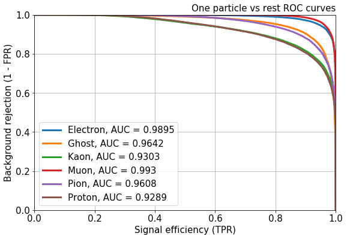
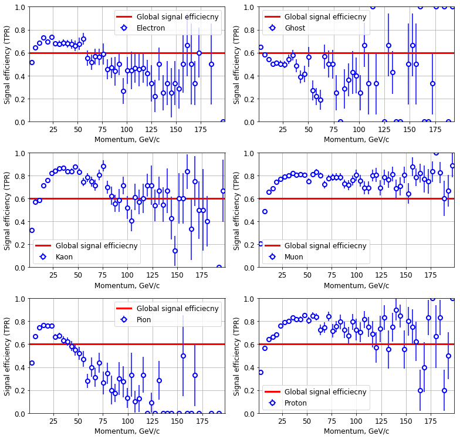
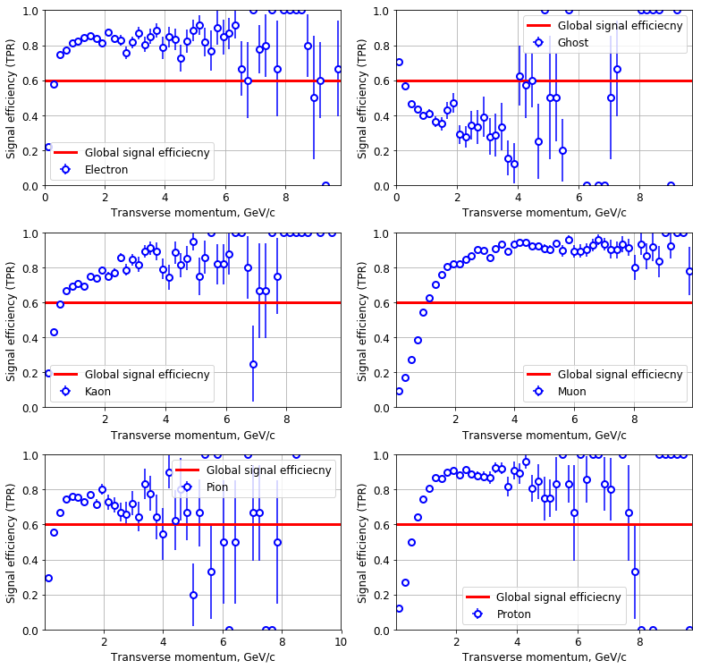

# About

In this programming assignment you will train a classifier to identify type of a particle. There are six particle types: electron, proton, muon, kaon, pion and ghost. Ghost is a particle with other type than the first five or a detector noise. 

Different particle types remain different responses in the detector systems or subdetectors. Thre are five systems: tracking system, ring imaging Cherenkov detector (RICH), electromagnetic and hadron calorimeters, and muon system.


You task is to identify a particle type using the responses in the detector systems. 

# Attention

Data files you should download from https://github.com/hse-aml/hadron-collider-machine-learning/releases/tag/Week_2


```python
%matplotlib inline
import matplotlib.pyplot as plt
import pandas
import numpy
from sklearn.model_selection import train_test_split
from sklearn.metrics import log_loss
import utils
```

# Download data

Download data used to train classifiers.

### Read training file


```python
data = pandas.read_csv('training.csv.gz')
```


```python
data.head()
```


<div>
<style scoped>
    .dataframe tbody tr th:only-of-type {
        vertical-align: middle;
    }

    .dataframe tbody tr th {
        vertical-align: top;
    }

    .dataframe thead th {
        text-align: right;
    }
</style>
<table border="1" class="dataframe">
  <thead>
    <tr style="text-align: right;">
      <th></th>
      <th>TrackP</th>
      <th>TrackNDoFSubdetector2</th>
      <th>BremDLLbeElectron</th>
      <th>MuonLooseFlag</th>
      <th>FlagSpd</th>
      <th>SpdE</th>
      <th>EcalDLLbeElectron</th>
      <th>DLLmuon</th>
      <th>RICHpFlagElectron</th>
      <th>EcalDLLbeMuon</th>
      <th>...</th>
      <th>TrackNDoF</th>
      <th>RICHpFlagMuon</th>
      <th>RICH_DLLbeKaon</th>
      <th>RICH_DLLbeElectron</th>
      <th>HcalE</th>
      <th>MuonFlag</th>
      <th>FlagMuon</th>
      <th>PrsE</th>
      <th>RICH_DLLbeMuon</th>
      <th>RICH_DLLbeProton</th>
    </tr>
  </thead>
  <tbody>
    <tr>
      <th>0</th>
      <td>74791.156263</td>
      <td>15.0</td>
      <td>0.232275</td>
      <td>1.0</td>
      <td>1.0</td>
      <td>3.2</td>
      <td>-2.505719</td>
      <td>6.604153</td>
      <td>1.0</td>
      <td>1.929960</td>
      <td>...</td>
      <td>28.0</td>
      <td>1.0</td>
      <td>-7.213300</td>
      <td>-0.280200</td>
      <td>5586.589846</td>
      <td>1.0</td>
      <td>1.0</td>
      <td>10.422315</td>
      <td>-2.081143e-07</td>
      <td>-24.824400</td>
    </tr>
    <tr>
      <th>1</th>
      <td>2738.489989</td>
      <td>15.0</td>
      <td>-0.357748</td>
      <td>0.0</td>
      <td>1.0</td>
      <td>3.2</td>
      <td>1.864351</td>
      <td>0.263651</td>
      <td>1.0</td>
      <td>-2.061959</td>
      <td>...</td>
      <td>32.0</td>
      <td>1.0</td>
      <td>-0.324317</td>
      <td>1.707283</td>
      <td>-0.000007</td>
      <td>0.0</td>
      <td>1.0</td>
      <td>43.334935</td>
      <td>2.771583e+00</td>
      <td>-0.648017</td>
    </tr>
    <tr>
      <th>2</th>
      <td>2161.409908</td>
      <td>17.0</td>
      <td>-999.000000</td>
      <td>0.0</td>
      <td>0.0</td>
      <td>-999.0</td>
      <td>-999.000000</td>
      <td>-999.000000</td>
      <td>0.0</td>
      <td>-999.000000</td>
      <td>...</td>
      <td>27.0</td>
      <td>0.0</td>
      <td>-999.000000</td>
      <td>-999.000000</td>
      <td>-999.000000</td>
      <td>0.0</td>
      <td>0.0</td>
      <td>-999.000000</td>
      <td>-9.990000e+02</td>
      <td>-999.000000</td>
    </tr>
    <tr>
      <th>3</th>
      <td>15277.730490</td>
      <td>20.0</td>
      <td>-0.638984</td>
      <td>0.0</td>
      <td>1.0</td>
      <td>3.2</td>
      <td>-2.533918</td>
      <td>-8.724949</td>
      <td>1.0</td>
      <td>-3.253981</td>
      <td>...</td>
      <td>36.0</td>
      <td>1.0</td>
      <td>-35.202221</td>
      <td>-14.742319</td>
      <td>4482.803707</td>
      <td>0.0</td>
      <td>1.0</td>
      <td>2.194175</td>
      <td>-3.070819e+00</td>
      <td>-29.291519</td>
    </tr>
    <tr>
      <th>4</th>
      <td>7563.700195</td>
      <td>19.0</td>
      <td>-0.638962</td>
      <td>0.0</td>
      <td>1.0</td>
      <td>3.2</td>
      <td>-2.087146</td>
      <td>-7.060422</td>
      <td>1.0</td>
      <td>-0.995816</td>
      <td>...</td>
      <td>33.0</td>
      <td>1.0</td>
      <td>25.084287</td>
      <td>-10.272412</td>
      <td>5107.554680</td>
      <td>0.0</td>
      <td>1.0</td>
      <td>0.000015</td>
      <td>-5.373712e+00</td>
      <td>23.653087</td>
    </tr>
  </tbody>
</table>
<p>5 rows × 50 columns</p>
</div>


### List of columns in the samples

Here, **Spd** stands for Scintillating Pad Detector, **Prs** - Preshower, **Ecal** - electromagnetic calorimeter, **Hcal** - hadronic calorimeter, **Brem** denotes traces of the particles that were deflected by detector.

- ID - id value for tracks (presents only in the test file for the submitting purposes)
- Label - string valued observable denoting particle types. Can take values "Electron", "Muon", "Kaon", "Proton", "Pion" and "Ghost". This column is absent in the test file.
- FlagSpd - flag (0 or 1), if reconstructed track passes through Spd
- FlagPrs - flag (0 or 1), if reconstructed track passes through Prs
- FlagBrem - flag (0 or 1), if reconstructed track passes through Brem
- FlagEcal - flag (0 or 1), if reconstructed track passes through Ecal
- FlagHcal - flag (0 or 1), if reconstructed track passes through Hcal
- FlagRICH1 - flag (0 or 1), if reconstructed track passes through the first RICH detector
- FlagRICH2 - flag (0 or 1), if reconstructed track passes through the second RICH detector
- FlagMuon - flag (0 or 1), if reconstructed track passes through muon stations (Muon)
- SpdE - energy deposit associated to the track in the Spd
- PrsE - energy deposit associated to the track in the Prs
- EcalE - energy deposit associated to the track in the Hcal
- HcalE - energy deposit associated to the track in the Hcal
- PrsDLLbeElectron - delta log-likelihood for a particle candidate to be electron using information from Prs
- BremDLLbeElectron - delta log-likelihood for a particle candidate to be electron using information from Brem
- TrackP - particle momentum
- TrackPt - particle transverse momentum
- TrackNDoFSubdetector1  - number of degrees of freedom for track fit using hits in the tracking sub-detector1
- TrackQualitySubdetector1 - chi2 quality of the track fit using hits in the tracking sub-detector1
- TrackNDoFSubdetector2 - number of degrees of freedom for track fit using hits in the tracking sub-detector2
- TrackQualitySubdetector2 - chi2 quality of the track fit using hits in the  tracking sub-detector2
- TrackNDoF - number of degrees of freedom for track fit using hits in all tracking sub-detectors
- TrackQualityPerNDoF - chi2 quality of the track fit per degree of freedom
- TrackDistanceToZ - distance between track and z-axis (beam axis)
- Calo2dFitQuality - quality of the 2d fit of the clusters in the calorimeter 
- Calo3dFitQuality - quality of the 3d fit in the calorimeter with assumption that particle was electron
- EcalDLLbeElectron - delta log-likelihood for a particle candidate to be electron using information from Ecal
- EcalDLLbeMuon - delta log-likelihood for a particle candidate to be muon using information from Ecal
- EcalShowerLongitudinalParameter - longitudinal parameter of Ecal shower
- HcalDLLbeElectron - delta log-likelihood for a particle candidate to be electron using information from Hcal
- HcalDLLbeMuon - delta log-likelihood for a particle candidate to be using information from Hcal
- RICHpFlagElectron - flag (0 or 1) if momentum is greater than threshold for electrons to produce Cherenkov light
- RICHpFlagProton - flag (0 or 1) if momentum is greater than threshold for protons to produce Cherenkov light
- RICHpFlagPion - flag (0 or 1) if momentum is greater than threshold for pions to produce Cherenkov light
- RICHpFlagKaon - flag (0 or 1) if momentum is greater than threshold for kaons to produce Cherenkov light
- RICHpFlagMuon - flag (0 or 1) if momentum is greater than threshold for muons to produce Cherenkov light
- RICH_DLLbeBCK  - delta log-likelihood for a particle candidate to be background using information from RICH
- RICH_DLLbeKaon - delta log-likelihood for a particle candidate to be kaon using information from RICH
- RICH_DLLbeElectron - delta log-likelihood for a particle candidate to be electron using information from RICH
- RICH_DLLbeMuon - delta log-likelihood for a particle candidate to be muon using information from RICH
- RICH_DLLbeProton - delta log-likelihood for a particle candidate to be proton using information from RICH
- MuonFlag - muon flag (is this track muon) which is determined from muon stations
- MuonLooseFlag muon flag (is this track muon) which is determined from muon stations using looser criteria
- MuonLLbeBCK - log-likelihood for a particle candidate to be not muon using information from muon stations
- MuonLLbeMuon - log-likelihood for a particle candidate to be muon using information from muon stations
- DLLelectron - delta log-likelihood for a particle candidate to be electron using information from all subdetectors
- DLLmuon - delta log-likelihood for a particle candidate to be muon using information from all subdetectors
- DLLkaon - delta log-likelihood for a particle candidate to be kaon using information from all subdetectors
- DLLproton - delta log-likelihood for a particle candidate to be proton using information from all subdetectors
- GhostProbability - probability for a particle candidate to be ghost track. This variable is an output of classification model used in the tracking algorithm.

Delta log-likelihood in the features descriptions means the difference between log-likelihood for the mass hypothesis that a given track is left by some particle (for example, electron) and log-likelihood for the mass hypothesis that a given track is left by a pion (so, DLLpion = 0 and thus we don't have these columns). This is done since most tracks (~80%) are left by pions and in practice we actually need to discriminate other particles from pions. In other words, the null hypothesis is that particle is a pion.

### Look at the labels set

The training data contains six classes. Each class corresponds to a particle type. Your task is to predict type of a particle.


```python
set(data.Label)
```


    {'Electron', 'Ghost', 'Kaon', 'Muon', 'Pion', 'Proton'}


Convert the particle types into class numbers.


```python
data['Class'] = utils.get_class_ids(data.Label.values)
set(data.Class)
```


    {0, 1, 2, 3, 4, 5}


### Define training features

The following set of features describe particle responses in the detector systems:


Also there are several combined features. The full list is following.


```python
features = list(set(data.columns) - {'Label', 'Class'})
features
```


    ['TrackNDoF',
     'HcalE',
     'MuonFlag',
     'DLLkaon',
     'FlagBrem',
     'RICH_DLLbeMuon',
     'TrackQualitySubdetector2',
     'FlagHcal',
     'RICH_DLLbeElectron',
     'SpdE',
     'TrackPt',
     'EcalDLLbeMuon',
     'RICHpFlagMuon',
     'Calo2dFitQuality',
     'HcalDLLbeElectron',
     'PrsE',
     'TrackNDoFSubdetector2',
     'MuonLooseFlag',
     'FlagSpd',
     'MuonLLbeMuon',
     'FlagRICH2',
     'RICH_DLLbeProton',
     'DLLmuon',
     'RICHpFlagElectron',
     'TrackDistanceToZ',
     'Calo3dFitQuality',
     'RICH_DLLbeBCK',
     'RICHpFlagKaon',
     'DLLproton',
     'RICHpFlagProton',
     'HcalDLLbeMuon',
     'MuonLLbeBCK',
     'FlagPrs',
     'RICHpFlagPion',
     'DLLelectron',
     'EcalDLLbeElectron',
     'RICH_DLLbeKaon',
     'EcalShowerLongitudinalParameter',
     'PrsDLLbeElectron',
     'GhostProbability',
     'TrackQualityPerNDoF',
     'TrackP',
     'FlagMuon',
     'TrackNDoFSubdetector1',
     'FlagEcal',
     'FlagRICH1',
     'BremDLLbeElectron',
     'TrackQualitySubdetector1',
     'EcalE']


### Divide training data into 2 parts


```python
training_data, validation_data = train_test_split(data, random_state=11, train_size=0.90, test_size=0.10)
```


```python
len(training_data), len(validation_data)
```


    (1080000, 120000)


```python
training_data.head()
```


<div>
<style scoped>
    .dataframe tbody tr th:only-of-type {
        vertical-align: middle;
    }

    .dataframe tbody tr th {
        vertical-align: top;
    }

    .dataframe thead th {
        text-align: right;
    }
</style>
<table border="1" class="dataframe">
  <thead>
    <tr style="text-align: right;">
      <th></th>
      <th>TrackP</th>
      <th>TrackNDoFSubdetector2</th>
      <th>BremDLLbeElectron</th>
      <th>MuonLooseFlag</th>
      <th>FlagSpd</th>
      <th>SpdE</th>
      <th>EcalDLLbeElectron</th>
      <th>DLLmuon</th>
      <th>RICHpFlagElectron</th>
      <th>EcalDLLbeMuon</th>
      <th>...</th>
      <th>RICHpFlagMuon</th>
      <th>RICH_DLLbeKaon</th>
      <th>RICH_DLLbeElectron</th>
      <th>HcalE</th>
      <th>MuonFlag</th>
      <th>FlagMuon</th>
      <th>PrsE</th>
      <th>RICH_DLLbeMuon</th>
      <th>RICH_DLLbeProton</th>
      <th>Class</th>
    </tr>
  </thead>
  <tbody>
    <tr>
      <th>968874</th>
      <td>12192.330089</td>
      <td>17.0</td>
      <td>-0.170024</td>
      <td>0.0</td>
      <td>1.0</td>
      <td>0.0</td>
      <td>-1.831868</td>
      <td>-0.996012</td>
      <td>1.0</td>
      <td>5.017775e-01</td>
      <td>...</td>
      <td>1.0</td>
      <td>-19.783108</td>
      <td>-6.720408</td>
      <td>1914.190913</td>
      <td>1.0</td>
      <td>1.0</td>
      <td>1.967353e-06</td>
      <td>-2.804208</td>
      <td>-25.041909</td>
      <td>1</td>
    </tr>
    <tr>
      <th>912808</th>
      <td>40379.488299</td>
      <td>7.0</td>
      <td>-999.000000</td>
      <td>0.0</td>
      <td>0.0</td>
      <td>-999.0</td>
      <td>-999.000000</td>
      <td>-0.792678</td>
      <td>1.0</td>
      <td>-9.990000e+02</td>
      <td>...</td>
      <td>1.0</td>
      <td>-14.755493</td>
      <td>-2.304893</td>
      <td>-999.000000</td>
      <td>0.0</td>
      <td>1.0</td>
      <td>-9.990000e+02</td>
      <td>-0.967993</td>
      <td>-18.450494</td>
      <td>4</td>
    </tr>
    <tr>
      <th>30045</th>
      <td>5294.729989</td>
      <td>12.0</td>
      <td>-0.381504</td>
      <td>1.0</td>
      <td>1.0</td>
      <td>3.2</td>
      <td>-0.589851</td>
      <td>-2.054347</td>
      <td>1.0</td>
      <td>-2.142670e+00</td>
      <td>...</td>
      <td>1.0</td>
      <td>13.137106</td>
      <td>-7.920494</td>
      <td>2567.385966</td>
      <td>1.0</td>
      <td>1.0</td>
      <td>7.569901e+01</td>
      <td>-1.713094</td>
      <td>13.416006</td>
      <td>3</td>
    </tr>
    <tr>
      <th>313784</th>
      <td>4645.819821</td>
      <td>17.0</td>
      <td>-0.417099</td>
      <td>1.0</td>
      <td>1.0</td>
      <td>3.2</td>
      <td>0.649028</td>
      <td>-8.301831</td>
      <td>1.0</td>
      <td>7.650223e-07</td>
      <td>...</td>
      <td>1.0</td>
      <td>-22.006791</td>
      <td>-24.447692</td>
      <td>256.265351</td>
      <td>0.0</td>
      <td>1.0</td>
      <td>1.919901e+00</td>
      <td>-7.184691</td>
      <td>-17.656691</td>
      <td>1</td>
    </tr>
    <tr>
      <th>100864</th>
      <td>3100.629887</td>
      <td>17.0</td>
      <td>-0.553602</td>
      <td>0.0</td>
      <td>1.0</td>
      <td>3.2</td>
      <td>-2.723420</td>
      <td>-12.468398</td>
      <td>1.0</td>
      <td>-1.438773e+00</td>
      <td>...</td>
      <td>1.0</td>
      <td>0.807007</td>
      <td>-50.220193</td>
      <td>0.000011</td>
      <td>0.0</td>
      <td>1.0</td>
      <td>-8.050605e-07</td>
      <td>-9.541493</td>
      <td>0.771707</td>
      <td>2</td>
    </tr>
  </tbody>
</table>
<p>5 rows × 51 columns</p>
</div>


```python
training_data[features].describe()
```


<div>
<style scoped>
    .dataframe tbody tr th:only-of-type {
        vertical-align: middle;
    }

    .dataframe tbody tr th {
        vertical-align: top;
    }

    .dataframe thead th {
        text-align: right;
    }
</style>
<table border="1" class="dataframe">
  <thead>
    <tr style="text-align: right;">
      <th></th>
      <th>TrackNDoF</th>
      <th>HcalE</th>
      <th>MuonFlag</th>
      <th>DLLkaon</th>
      <th>FlagBrem</th>
      <th>RICH_DLLbeMuon</th>
      <th>TrackQualitySubdetector2</th>
      <th>FlagHcal</th>
      <th>RICH_DLLbeElectron</th>
      <th>SpdE</th>
      <th>...</th>
      <th>GhostProbability</th>
      <th>TrackQualityPerNDoF</th>
      <th>TrackP</th>
      <th>FlagMuon</th>
      <th>TrackNDoFSubdetector1</th>
      <th>FlagEcal</th>
      <th>FlagRICH1</th>
      <th>BremDLLbeElectron</th>
      <th>TrackQualitySubdetector1</th>
      <th>EcalE</th>
    </tr>
  </thead>
  <tbody>
    <tr>
      <th>count</th>
      <td>1.080000e+06</td>
      <td>1.080000e+06</td>
      <td>1.080000e+06</td>
      <td>1.080000e+06</td>
      <td>1.080000e+06</td>
      <td>1.080000e+06</td>
      <td>1.080000e+06</td>
      <td>1.080000e+06</td>
      <td>1.080000e+06</td>
      <td>1.080000e+06</td>
      <td>...</td>
      <td>1.080000e+06</td>
      <td>1.080000e+06</td>
      <td>1.080000e+06</td>
      <td>1.080000e+06</td>
      <td>1.080000e+06</td>
      <td>1.080000e+06</td>
      <td>1.080000e+06</td>
      <td>1.080000e+06</td>
      <td>1.080000e+06</td>
      <td>1.080000e+06</td>
    </tr>
    <tr>
      <th>mean</th>
      <td>2.942315e+01</td>
      <td>2.898032e+03</td>
      <td>1.662343e-01</td>
      <td>-1.452442e+01</td>
      <td>7.918694e-01</td>
      <td>-4.926364e+01</td>
      <td>1.609497e+01</td>
      <td>7.646630e-01</td>
      <td>-5.109546e+01</td>
      <td>-1.445036e+02</td>
      <td>...</td>
      <td>5.513315e-02</td>
      <td>1.282943e+00</td>
      <td>1.613264e+04</td>
      <td>8.207509e-01</td>
      <td>6.198936e+00</td>
      <td>8.175639e-01</td>
      <td>8.325130e-01</td>
      <td>-2.076723e+02</td>
      <td>6.851082e+00</td>
      <td>2.346141e+03</td>
    </tr>
    <tr>
      <th>std</th>
      <td>6.026995e+00</td>
      <td>7.656111e+03</td>
      <td>3.722910e-01</td>
      <td>1.074946e+02</td>
      <td>4.059709e-01</td>
      <td>2.148977e+02</td>
      <td>7.769702e+00</td>
      <td>4.242095e-01</td>
      <td>2.152222e+02</td>
      <td>3.546216e+02</td>
      <td>...</td>
      <td>9.242857e-02</td>
      <td>6.270840e-01</td>
      <td>2.753921e+04</td>
      <td>3.835609e-01</td>
      <td>3.115005e+00</td>
      <td>3.862037e-01</td>
      <td>3.734103e-01</td>
      <td>4.054207e+02</td>
      <td>5.071566e+00</td>
      <td>5.709488e+03</td>
    </tr>
    <tr>
      <th>min</th>
      <td>7.000000e+00</td>
      <td>-9.990000e+02</td>
      <td>0.000000e+00</td>
      <td>-9.990000e+02</td>
      <td>0.000000e+00</td>
      <td>-9.990000e+02</td>
      <td>3.229625e-04</td>
      <td>0.000000e+00</td>
      <td>-9.990000e+02</td>
      <td>-9.990000e+02</td>
      <td>...</td>
      <td>1.456686e-03</td>
      <td>4.504852e-02</td>
      <td>1.115380e+03</td>
      <td>0.000000e+00</td>
      <td>1.000000e+00</td>
      <td>0.000000e+00</td>
      <td>0.000000e+00</td>
      <td>-9.990000e+02</td>
      <td>9.406193e-06</td>
      <td>-9.990000e+02</td>
    </tr>
    <tr>
      <th>25%</th>
      <td>2.600000e+01</td>
      <td>-1.446553e-05</td>
      <td>0.000000e+00</td>
      <td>-1.069791e+01</td>
      <td>1.000000e+00</td>
      <td>-4.503437e+00</td>
      <td>1.071093e+01</td>
      <td>1.000000e+00</td>
      <td>-1.309732e+01</td>
      <td>0.000000e+00</td>
      <td>...</td>
      <td>3.852832e-03</td>
      <td>8.856753e-01</td>
      <td>4.135297e+03</td>
      <td>1.000000e+00</td>
      <td>4.000000e+00</td>
      <td>1.000000e+00</td>
      <td>1.000000e+00</td>
      <td>-6.250978e-01</td>
      <td>3.080789e+00</td>
      <td>-3.348990e-06</td>
    </tr>
    <tr>
      <th>50%</th>
      <td>3.000000e+01</td>
      <td>5.772029e+02</td>
      <td>0.000000e+00</td>
      <td>2.762477e-06</td>
      <td>1.000000e+00</td>
      <td>-4.692121e-01</td>
      <td>1.524483e+01</td>
      <td>1.000000e+00</td>
      <td>-2.355985e+00</td>
      <td>3.200000e+00</td>
      <td>...</td>
      <td>9.668268e-03</td>
      <td>1.106393e+00</td>
      <td>8.064075e+03</td>
      <td>1.000000e+00</td>
      <td>6.000000e+00</td>
      <td>1.000000e+00</td>
      <td>1.000000e+00</td>
      <td>-5.329020e-01</td>
      <td>5.845922e+00</td>
      <td>6.599040e+02</td>
    </tr>
    <tr>
      <th>75%</th>
      <td>3.400000e+01</td>
      <td>3.047605e+03</td>
      <td>0.000000e+00</td>
      <td>8.460730e+00</td>
      <td>1.000000e+00</td>
      <td>1.300734e+00</td>
      <td>2.041093e+01</td>
      <td>1.000000e+00</td>
      <td>1.672999e+00</td>
      <td>3.200000e+00</td>
      <td>...</td>
      <td>5.510186e-02</td>
      <td>1.448324e+00</td>
      <td>1.749550e+04</td>
      <td>1.000000e+00</td>
      <td>8.000000e+00</td>
      <td>1.000000e+00</td>
      <td>1.000000e+00</td>
      <td>-5.933648e-02</td>
      <td>9.508951e+00</td>
      <td>3.001512e+03</td>
    </tr>
    <tr>
      <th>max</th>
      <td>5.200000e+01</td>
      <td>7.985253e+05</td>
      <td>1.000000e+00</td>
      <td>1.681698e+02</td>
      <td>1.000000e+00</td>
      <td>1.428335e+02</td>
      <td>1.048634e+02</td>
      <td>1.000000e+00</td>
      <td>1.861542e+02</td>
      <td>3.200000e+00</td>
      <td>...</td>
      <td>4.000019e-01</td>
      <td>3.999967e+00</td>
      <td>4.673862e+06</td>
      <td>1.000000e+00</td>
      <td>2.400000e+01</td>
      <td>1.000000e+00</td>
      <td>1.000000e+00</td>
      <td>4.791513e+00</td>
      <td>9.914788e+01</td>
      <td>3.156805e+05</td>
    </tr>
  </tbody>
</table>
<p>8 rows × 49 columns</p>
</div>


```python
training_data[features].isnull().any().any()
```


    False


```python
from sklearn.preprocessing import StandardScaler
scaler = StandardScaler()
training_scale = scaler.fit_transform(training_data[features].values)
```


```python
validation_scale = scaler.transform(validation_data[features].values)
```

# Sklearn classifier

On this step your task is to train **Sklearn** classifier to provide lower **log loss** value.


TASK: your task is to tune the classifier parameters to achieve the lowest **log loss** value on the validation sample you can.


```python
from sklearn.ensemble import GradientBoostingClassifier
```


```python
%%time 
gb = GradientBoostingClassifier(learning_rate=0.1, n_estimators=50, subsample=0.8, random_state=13,
                                min_samples_leaf=1, max_depth=3)
gb.fit(training_scale, training_data.Class.values)
```

    Wall time: 22min


### Log loss on the cross validation sample


```python
# predict each track
proba_gb = gb.predict_proba(validation_scale)
```


```python
log_loss(validation_data.Class.values, proba_gb)
```


    0.6670030859005405


# Keras neural network

On this step your task is to train **Keras** NN classifier to provide lower **log loss** value.


TASK: your task is to tune the classifier parameters to achieve the lowest **log loss** value on the validation sample you can. Data preprocessing may help you to improve your score.


```python
from keras.layers.core import Dense, Activation
from keras.models import Sequential
from keras.optimizers import Adam
from keras.utils import np_utils
from keras.callbacks import EarlyStopping, ModelCheckpoint
```


```python
def nn_model(input_dim):
    model = Sequential()
    model.add(Dense(100, input_dim=input_dim))
    model.add(Activation('relu'))
    
    model.add(Dense(50))
    model.add(Activation('relu'))

    model.add(Dense(6))
    model.add(Activation('softmax'))

    model.compile(loss='categorical_crossentropy', optimizer=Adam())
    return model
```


```python
callback = [EarlyStopping(monitor='val_loss', min_delta=0, patience=4, verbose=0, mode='auto'),
            ModelCheckpoint('output/{val_loss:.4f}.hdf5', monitor='val_loss', verbose=1, save_best_only=True, mode='auto')]
```


```python
nn = nn_model(len(features))
nn.fit(training_scale, np_utils.to_categorical(training_data.Class.values),
       validation_data=(validation_scale, np_utils.to_categorical(validation_data.Class.values)),
       epochs=50, verbose=1, batch_size=256, callbacks=callback)
```

    Train on 1080000 samples, validate on 120000 samples
    Epoch 1/50
    1080000/1080000 [==============================] - 12s 11us/step - loss: 0.7070 - val_loss: 0.6224
    
    Epoch 00001: val_loss improved from 0.63063 to 0.62237, saving model to output/0.6224.hdf5
    Epoch 2/50
    1080000/1080000 [==============================] - 12s 11us/step - loss: 0.6170 - val_loss: 0.6075
    
    Epoch 00002: val_loss improved from 0.62237 to 0.60745, saving model to output/0.6075.hdf5
    Epoch 3/50
    1080000/1080000 [==============================] - 12s 11us/step - loss: 0.6038 - val_loss: 0.5977
    
    Epoch 00003: val_loss improved from 0.60745 to 0.59774, saving model to output/0.5977.hdf5
    Epoch 4/50
    1080000/1080000 [==============================] - 12s 11us/step - loss: 0.5972 - val_loss: 0.5917
    
    Epoch 00004: val_loss improved from 0.59774 to 0.59168, saving model to output/0.5917.hdf5
    Epoch 5/50
    1080000/1080000 [==============================] - 12s 11us/step - loss: 0.5923 - val_loss: 0.5904
    
    Epoch 00005: val_loss improved from 0.59168 to 0.59038, saving model to output/0.5904.hdf5
    Epoch 6/50
    1080000/1080000 [==============================] - 12s 11us/step - loss: 0.5882 - val_loss: 0.5863
    
    Epoch 00006: val_loss improved from 0.59038 to 0.58633, saving model to output/0.5863.hdf5
    Epoch 7/50
    1080000/1080000 [==============================] - 12s 11us/step - loss: 0.5845 - val_loss: 0.5841
    
    Epoch 00007: val_loss improved from 0.58633 to 0.58408, saving model to output/0.5841.hdf5
    Epoch 8/50
    1080000/1080000 [==============================] - 12s 11us/step - loss: 0.5823 - val_loss: 0.5828
    
    Epoch 00008: val_loss improved from 0.58408 to 0.58282, saving model to output/0.5828.hdf5
    Epoch 9/50
    1080000/1080000 [==============================] - 12s 11us/step - loss: 0.5798 - val_loss: 0.5835
    
    Epoch 00009: val_loss did not improve from 0.58282
    Epoch 10/50
    1080000/1080000 [==============================] - 12s 11us/step - loss: 0.5786 - val_loss: 0.5775
    
    Epoch 00010: val_loss improved from 0.58282 to 0.57750, saving model to output/0.5775.hdf5
    Epoch 11/50
    1080000/1080000 [==============================] - 12s 11us/step - loss: 0.5765 - val_loss: 0.5796
    
    Epoch 00011: val_loss did not improve from 0.57750
    Epoch 12/50
    1080000/1080000 [==============================] - 12s 11us/step - loss: 0.5755 - val_loss: 0.5769
    
    Epoch 00012: val_loss improved from 0.57750 to 0.57690, saving model to output/0.5769.hdf5
    Epoch 13/50
    1080000/1080000 [==============================] - 12s 11us/step - loss: 0.5741 - val_loss: 0.5754
    
    Epoch 00013: val_loss improved from 0.57690 to 0.57543, saving model to output/0.5754.hdf5
    Epoch 14/50
    1080000/1080000 [==============================] - 12s 11us/step - loss: 0.5732 - val_loss: 0.5772
    
    Epoch 00014: val_loss did not improve from 0.57543
    Epoch 15/50
    1080000/1080000 [==============================] - 12s 11us/step - loss: 0.5723 - val_loss: 0.5740
    
    Epoch 00015: val_loss improved from 0.57543 to 0.57403, saving model to output/0.5740.hdf5
    Epoch 16/50
    1080000/1080000 [==============================] - 12s 11us/step - loss: 0.5716 - val_loss: 0.5724
    
    Epoch 00016: val_loss improved from 0.57403 to 0.57244, saving model to output/0.5724.hdf5
    Epoch 17/50
    1080000/1080000 [==============================] - 11s 11us/step - loss: 0.5706 - val_loss: 0.5718
    
    Epoch 00017: val_loss improved from 0.57244 to 0.57181, saving model to output/0.5718.hdf5
    Epoch 18/50
    1080000/1080000 [==============================] - 11s 11us/step - loss: 0.5698 - val_loss: 0.5743
    
    Epoch 00018: val_loss did not improve from 0.57181
    Epoch 19/50
    1080000/1080000 [==============================] - 11s 11us/step - loss: 0.5693 - val_loss: 0.5699
    
    Epoch 00019: val_loss improved from 0.57181 to 0.56993, saving model to output/0.5699.hdf5
    Epoch 20/50
    1080000/1080000 [==============================] - 12s 11us/step - loss: 0.5687 - val_loss: 0.5703
    
    Epoch 00020: val_loss did not improve from 0.56993
    Epoch 21/50
    1080000/1080000 [==============================] - 12s 11us/step - loss: 0.5678 - val_loss: 0.5701
    
    Epoch 00021: val_loss did not improve from 0.56993
    Epoch 22/50
    1080000/1080000 [==============================] - 12s 11us/step - loss: 0.5677 - val_loss: 0.5722
    
    Epoch 00022: val_loss did not improve from 0.56993
    Epoch 23/50
    1080000/1080000 [==============================] - 12s 11us/step - loss: 0.5672 - val_loss: 0.5680
    
    Epoch 00023: val_loss improved from 0.56993 to 0.56801, saving model to output/0.5680.hdf5
    Epoch 24/50
    1080000/1080000 [==============================] - 12s 11us/step - loss: 0.5664 - val_loss: 0.5718
    
    Epoch 00024: val_loss did not improve from 0.56801
    Epoch 25/50
    1080000/1080000 [==============================] - 12s 11us/step - loss: 0.5662 - val_loss: 0.5692
    
    Epoch 00025: val_loss did not improve from 0.56801
    Epoch 26/50
    1080000/1080000 [==============================] - 12s 11us/step - loss: 0.5658 - val_loss: 0.5696
    
    Epoch 00026: val_loss did not improve from 0.56801
    Epoch 27/50
    1080000/1080000 [==============================] - 12s 11us/step - loss: 0.5654 - val_loss: 0.5687
    
    Epoch 00027: val_loss did not improve from 0.56801


    <keras.callbacks.History at 0x18827cb7320>


```python
nn.load_weights('output/0.5680.hdf5')
```

### Log loss on the cross validation sample


```python
# predict each track
proba_nn = nn.predict_proba(validation_scale)
```


```python
log_loss(validation_data.Class.values, proba_nn)
```


    0.5681154022580016


# Quality metrics

Plot ROC curves and signal efficiency dependece from particle mometum and transverse momentum values.


```python
proba = proba_nn
```


```python
utils.plot_roc_curves(proba, validation_data.Class.values)
```





```python
utils.plot_signal_efficiency_on_p(proba, validation_data.Class.values, validation_data.TrackP.values, 60, 50)
plt.show()
```





```python
utils.plot_signal_efficiency_on_pt(proba, validation_data.Class.values, validation_data.TrackPt.values, 60, 50)
plt.show()
```





# Prepare submission

Select your best classifier and prepare submission file.


```python
test = pandas.read_csv('test.csv.gz')
```


```python
best_model = nn
```


```python
test_scale = scaler.transform(test[features])
```


```python
# predict test sample
submit_proba = best_model.predict_proba(test_scale)
submit_ids = test.ID
```


```python
from IPython.display import FileLink
utils.create_solution(submit_ids, submit_proba, filename='submission_file.csv.gz')
```


<a href='submission_file.csv.gz' target='_blank'>submission_file.csv.gz</a><br>


```python

```
