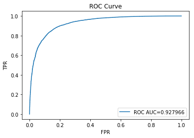
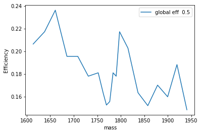
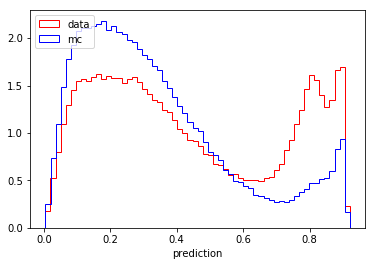
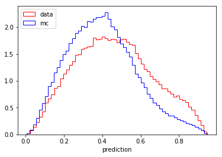
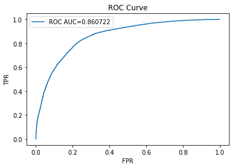

```python
%pylab inline
```

    Populating the interactive namespace from numpy and matplotlib


```python
import pandas
from sklearn.model_selection import train_test_split

from sklearn.ensemble import AdaBoostClassifier
from sklearn.tree import DecisionTreeClassifier

from sklearn.metrics import roc_curve, roc_auc_score
```

# Load dataset and split into training / test

`training.csv` is a mixture of simulated signal, real background.
It has the following columnt

`test.csv` has the following columns:


```python
train_ada = pandas.read_csv('reference/training.csv', sep=',')
test_ada = pandas.read_csv('reference/test.csv', sep=',', index_col='id')
```


```python
print ("Training full sample columns:", ", ".join(train_ada.columns), "\nShape:", train_ada.shape)
```

    Training full sample columns: id, LifeTime, dira, FlightDistance, FlightDistanceError, IP, IPSig, VertexChi2, pt, DOCAone, DOCAtwo, DOCAthree, IP_p0p2, IP_p1p2, isolationa, isolationb, isolationc, isolationd, isolatione, isolationf, iso, CDF1, CDF2, CDF3, ISO_SumBDT, p0_IsoBDT, p1_IsoBDT, p2_IsoBDT, p0_track_Chi2Dof, p1_track_Chi2Dof, p2_track_Chi2Dof, p0_IP, p1_IP, p2_IP, p0_IPSig, p1_IPSig, p2_IPSig, p0_pt, p1_pt, p2_pt, p0_p, p1_p, p2_p, p0_eta, p1_eta, p2_eta, SPDhits, production, signal, mass, min_ANNmuon 
    Shape: (67553, 51)


```python
print ("Test full sample columns:", ", ".join(test_ada.columns), "\nShape:", test_ada.shape)
test_ada.head()
```

    Test full sample columns: LifeTime, dira, FlightDistance, FlightDistanceError, IP, IPSig, VertexChi2, pt, DOCAone, DOCAtwo, DOCAthree, IP_p0p2, IP_p1p2, isolationa, isolationb, isolationc, isolationd, isolatione, isolationf, iso, CDF1, CDF2, CDF3, ISO_SumBDT, p0_IsoBDT, p1_IsoBDT, p2_IsoBDT, p0_track_Chi2Dof, p1_track_Chi2Dof, p2_track_Chi2Dof, p0_IP, p1_IP, p2_IP, p0_IPSig, p1_IPSig, p2_IPSig, p0_pt, p1_pt, p2_pt, p0_p, p1_p, p2_p, p0_eta, p1_eta, p2_eta, SPDhits 
    Shape: (855819, 46)


<div>
<style scoped>
    .dataframe tbody tr th:only-of-type {
        vertical-align: middle;
    }

    .dataframe tbody tr th {
        vertical-align: top;
    }

    .dataframe thead th {
        text-align: right;
    }
</style>
<table border="1" class="dataframe">
  <thead>
    <tr style="text-align: right;">
      <th></th>
      <th>LifeTime</th>
      <th>dira</th>
      <th>FlightDistance</th>
      <th>FlightDistanceError</th>
      <th>IP</th>
      <th>IPSig</th>
      <th>VertexChi2</th>
      <th>pt</th>
      <th>DOCAone</th>
      <th>DOCAtwo</th>
      <th>...</th>
      <th>p0_pt</th>
      <th>p1_pt</th>
      <th>p2_pt</th>
      <th>p0_p</th>
      <th>p1_p</th>
      <th>p2_p</th>
      <th>p0_eta</th>
      <th>p1_eta</th>
      <th>p2_eta</th>
      <th>SPDhits</th>
    </tr>
    <tr>
      <th>id</th>
      <th></th>
      <th></th>
      <th></th>
      <th></th>
      <th></th>
      <th></th>
      <th></th>
      <th></th>
      <th></th>
      <th></th>
      <th></th>
      <th></th>
      <th></th>
      <th></th>
      <th></th>
      <th></th>
      <th></th>
      <th></th>
      <th></th>
      <th></th>
      <th></th>
    </tr>
  </thead>
  <tbody>
    <tr>
      <th>14711831</th>
      <td>0.001273</td>
      <td>0.999816</td>
      <td>8.569642</td>
      <td>0.310039</td>
      <td>0.197893</td>
      <td>5.183939</td>
      <td>2.286117</td>
      <td>687.479248</td>
      <td>0.022301</td>
      <td>0.050763</td>
      <td>...</td>
      <td>508.926514</td>
      <td>306.629456</td>
      <td>714.222717</td>
      <td>30300.734375</td>
      <td>5662.158691</td>
      <td>7406.368164</td>
      <td>4.779700</td>
      <td>3.608334</td>
      <td>3.029715</td>
      <td>705</td>
    </tr>
    <tr>
      <th>16316387</th>
      <td>0.000661</td>
      <td>0.999954</td>
      <td>7.061379</td>
      <td>0.348772</td>
      <td>0.067430</td>
      <td>6.316281</td>
      <td>3.865824</td>
      <td>5691.845703</td>
      <td>0.002455</td>
      <td>0.037633</td>
      <td>...</td>
      <td>943.130676</td>
      <td>3287.291260</td>
      <td>1563.593994</td>
      <td>6160.323730</td>
      <td>43781.566406</td>
      <td>19728.500000</td>
      <td>2.563915</td>
      <td>3.280884</td>
      <td>3.226650</td>
      <td>907</td>
    </tr>
    <tr>
      <th>6771382</th>
      <td>0.000889</td>
      <td>0.999999</td>
      <td>6.502967</td>
      <td>0.273914</td>
      <td>0.011020</td>
      <td>0.865816</td>
      <td>1.004631</td>
      <td>5429.225586</td>
      <td>0.002753</td>
      <td>0.036379</td>
      <td>...</td>
      <td>2886.055908</td>
      <td>2216.936279</td>
      <td>598.068359</td>
      <td>26387.134766</td>
      <td>15534.978516</td>
      <td>6504.145020</td>
      <td>2.903129</td>
      <td>2.634985</td>
      <td>3.077517</td>
      <td>213</td>
    </tr>
    <tr>
      <th>686045</th>
      <td>0.001295</td>
      <td>0.999301</td>
      <td>7.838184</td>
      <td>0.325697</td>
      <td>0.388636</td>
      <td>11.391245</td>
      <td>10.345356</td>
      <td>661.717834</td>
      <td>0.008163</td>
      <td>0.436003</td>
      <td>...</td>
      <td>461.727753</td>
      <td>357.967560</td>
      <td>1118.084229</td>
      <td>5451.857422</td>
      <td>10281.403320</td>
      <td>23722.742188</td>
      <td>3.160085</td>
      <td>4.050494</td>
      <td>3.747409</td>
      <td>275</td>
    </tr>
    <tr>
      <th>8755882</th>
      <td>0.001714</td>
      <td>0.999805</td>
      <td>7.064559</td>
      <td>0.113440</td>
      <td>0.154421</td>
      <td>13.925871</td>
      <td>12.951378</td>
      <td>3885.417969</td>
      <td>0.066317</td>
      <td>0.052183</td>
      <td>...</td>
      <td>1773.747925</td>
      <td>1643.278198</td>
      <td>711.572205</td>
      <td>7724.954590</td>
      <td>12830.546875</td>
      <td>6008.145996</td>
      <td>2.151059</td>
      <td>2.744157</td>
      <td>2.823017</td>
      <td>357</td>
    </tr>
  </tbody>
</table>
<p>5 rows × 46 columns</p>
</div>


# Train simple model using part of the training sample


```python
train, test = train_test_split(train_ada, train_size=0.7, random_state=13) 
```

    C:\ProgramData\Anaconda3\lib\site-packages\sklearn\model_selection\_split.py:2179: FutureWarning: From version 0.21, test_size will always complement train_size unless both are specified.
      FutureWarning)


Let's chose features to train a model


```python
variables = list(set(train_ada.columns) - {'id', 'signal', 'mass', 'production', 'min_ANNmuon'})
print (variables)
```

    ['VertexChi2', 'p0_pt', 'p1_pt', 'CDF3', 'p0_IP', 'pt', 'isolationf', 'FlightDistance', 'p0_IsoBDT', 'p0_eta', 'IPSig', 'isolationc', 'isolatione', 'IP', 'IP_p1p2', 'CDF2', 'p2_track_Chi2Dof', 'IP_p0p2', 'dira', 'isolationa', 'p1_track_Chi2Dof', 'DOCAtwo', 'ISO_SumBDT', 'LifeTime', 'p2_IP', 'p2_eta', 'p0_p', 'p1_IP', 'p1_IsoBDT', 'p2_IsoBDT', 'CDF1', 'p0_track_Chi2Dof', 'p1_eta', 'SPDhits', 'isolationb', 'DOCAone', 'DOCAthree', 'p2_IPSig', 'iso', 'p0_IPSig', 'isolationd', 'p2_p', 'p1_IPSig', 'p2_pt', 'FlightDistanceError', 'p1_p']


```python
%%time
clf = AdaBoostClassifier(n_estimators=200, learning_rate=0.01/2, random_state=13,
                             base_estimator=DecisionTreeClassifier(max_depth=6, min_samples_leaf=30, max_features=7,
                                                                    random_state=13))
clf.fit(train[variables], train['signal']) 
```

    Wall time: 1min 16s


# Check model quality on a half of the training sample


```python
def plot_metrics(y_true, y_pred):
    fpr, tpr, thresholds = roc_curve(y_true, y_pred)
    roc_auc = roc_auc_score(y_true, y_pred)

    plt.plot(fpr, tpr, label='ROC AUC=%f' % roc_auc)
    plt.xlabel("FPR")
    plt.ylabel("TPR")
    plt.legend()
    plt.title("ROC Curve")
```


```python
y_pred = clf.predict_proba(test[variables])[:, 1]

plot_metrics(test['signal'], y_pred)
test.shape, y_pred.shape
```


    ((20266, 51), (20266,))





ROC AUC is just a part of the solution, you also have to make sure that

- the classifier output is not correlated with the mass
- classifier performs similarily on MC and real data of the normalization channel


### Mass correlation check


```python
df_corr_check = pandas.read_csv("reference/check_correlation.csv")
```


```python
df_corr_check.shape
```


    (5514, 48)


```python
y_pred = clf.predict(df_corr_check[variables])
```


```python

```


```python
 def efficiencies(features, thresholds=None, mask=None, bins=30, labels_dict=None, ignored_sideband=0.0,
                     errors=False, grid_columns=2):
        """
        Efficiencies for spectators
        :param features: using features (if None then use classifier's spectators)
        :type features: None or list[str]
        :param bins: bins for histogram
        :type bins: int or array-like
        :param mask: mask for data, which will be used
        :type mask: None or numbers.Number or array-like or str or function(pandas.DataFrame)
        :param list[float] thresholds: thresholds on prediction
        :param bool errors: if True then use errorbar, else interpolate function
        :param labels_dict: label -- name for class label
            if None then {0: 'bck', '1': 'signal'}
        :type labels_dict: None or OrderedDict(int: str)
        :param int grid_columns: count of columns in grid
        :param float ignored_sideband: (0, 1) percent of plotting data
        :rtype: plotting.GridPlot
        """
        mask, data, class_labels, weight = self._apply_mask(
            mask, self._get_features(features), self.target, self.weight)
        labels_dict = self._check_labels(labels_dict, class_labels)

        plots = []
        for feature in data.columns:
            for name, prediction in self.prediction.items():
                prediction = prediction[mask]
                eff = OrderedDict()
                for label, label_name in labels_dict.items():
                    label_mask = class_labels == label
                    eff[label_name] = utils.get_efficiencies(prediction[label_mask, label],
                                                             data[feature][label_mask].values,
                                                             bins_number=bins,
                                                             sample_weight=weight[label_mask],
                                                             thresholds=thresholds, errors=errors,
                                                             ignored_sideband=ignored_sideband)

                for label_name, eff_data in eff.items():
                    if errors:
                        plot_fig = plotting.ErrorPlot(eff_data)
                    else:
                        plot_fig = plotting.FunctionsPlot(eff_data)
                    plot_fig.xlabel = feature
                    plot_fig.ylabel = 'Efficiency for {}'.format(name)
                    plot_fig.title = '{} flatness'.format(label_name)
                    plot_fig.ylim = (0, 1)
                    plots.append(plot_fig)

        return plotting.GridPlot(grid_columns, *plots)
```


```python
def check_arrays(*arrays):
    """
    Left for consistency, version of `sklearn.validation.check_arrays`
    :param list[iterable] arrays: arrays with same length of first dimension.
    """
    assert len(arrays) > 0, 'The number of array must be greater than zero'
    checked_arrays = []
    shapes = []
    for arr in arrays:
        if arr is not None:
            checked_arrays.append(numpy.array(arr))
            shapes.append(checked_arrays[-1].shape[0])
        else:
            checked_arrays.append(None)
    assert numpy.sum(numpy.array(shapes) == shapes[0]) == len(shapes), 'Different shapes of the arrays {}'.format(
        shapes)
    return checked_arrays
```


```python
def get_efficiencies(prediction, spectator, sample_weight=None, bins_number=20,
                     thresholds=None, errors=False, ignored_sideband=0.0):
    """
    Construct efficiency function dependent on spectator for each threshold
    Different score functions available: Efficiency, Precision, Recall, F1Score,
    and other things from sklearn.metrics
    :param prediction: list of probabilities
    :param spectator: list of spectator's values
    :param bins_number: int, count of bins for plot
    :param thresholds: list of prediction's threshold
        (default=prediction's cuts for which efficiency will be [0.2, 0.4, 0.5, 0.6, 0.8])
    :return:
        if errors=False
        OrderedDict threshold -> (x_values, y_values)
        if errors=True
        OrderedDict threshold -> (x_values, y_values, y_err, x_err)
        All the parts: x_values, y_values, y_err, x_err are numpy.arrays of the same length.
    """
    prediction, spectator, sample_weight = \
        check_arrays(prediction, spectator, sample_weight)

    spectator_min, spectator_max = weighted_quantile(spectator, [ignored_sideband, (1. - ignored_sideband)])
    mask = (spectator >= spectator_min) & (spectator <= spectator_max)
    spectator = spectator[mask]
    prediction = prediction[mask]
    bins_number = min(bins_number, len(prediction))
    sample_weight = sample_weight if sample_weight is None else numpy.array(sample_weight)[mask]

    if thresholds is None:
        thresholds = [weighted_quantile(prediction, quantiles=1 - eff, sample_weight=sample_weight)
                      for eff in [0.2, 0.4, 0.5, 0.6, 0.8]]

    binner = Binner(spectator, bins_number=bins_number)
    if sample_weight is None:
        sample_weight = numpy.ones(len(prediction))
    bins_data = binner.split_into_bins(spectator, prediction, sample_weight)

    bin_edges = numpy.array([spectator_min] + list(binner.limits) + [spectator_max])
    xerr = numpy.diff(bin_edges) / 2.
    result = OrderedDict()
    for threshold in thresholds:
        x_values = []
        y_values = []
        N_in_bin = []
        for num, (masses, probabilities, weights) in enumerate(bins_data):
            y_values.append(numpy.average(probabilities > threshold, weights=weights))
            N_in_bin.append(numpy.sum(weights))
            if errors:
                x_values.append((bin_edges[num + 1] + bin_edges[num]) / 2.)
            else:
                x_values.append(numpy.mean(masses))

        x_values, y_values, N_in_bin = check_arrays(x_values, y_values, N_in_bin)
        if errors:
            result[threshold] = (x_values, y_values, numpy.sqrt(y_values * (1 - y_values) / N_in_bin), xerr)
        else:
            result[threshold] = (x_values, y_values)
    return result
```


```python
def weighted_quantile(array, quantiles, sample_weight=None, array_sorted=False, old_style=False):
    """Computing quantiles of array. Unlike the numpy.percentile, this function supports weights,
    but it is inefficient and performs complete sorting.
    :param array: distribution, array of shape [n_samples]
    :param quantiles: floats from range [0, 1] with quantiles of shape [n_quantiles]
    :param sample_weight: optional weights of samples, array of shape [n_samples]
    :param array_sorted: if True, the sorting step will be skipped
    :param old_style: if True, will correct output to be consistent with numpy.percentile.
    :return: array of shape [n_quantiles]
    Example:
    >>> weighted_quantile([1, 2, 3, 4, 5], [0.5])
    Out: array([ 3.])
    >>> weighted_quantile([1, 2, 3, 4, 5], [0.5], sample_weight=[3, 1, 1, 1, 1])
    Out: array([ 2.])
    """
    array = numpy.array(array)
    quantiles = numpy.array(quantiles)
    sample_weight = check_sample_weight(array, sample_weight)
    assert numpy.all(quantiles >= 0) and numpy.all(quantiles <= 1), 'Percentiles should be in [0, 1]'

    if not array_sorted:
        array, sample_weight = reorder_by_first(array, sample_weight)

    weighted_quantiles = numpy.cumsum(sample_weight) - 0.5 * sample_weight
    if old_style:
        # To be convenient with numpy.percentile
        weighted_quantiles -= weighted_quantiles[0]
        weighted_quantiles /= weighted_quantiles[-1]
    else:
        weighted_quantiles /= numpy.sum(sample_weight)
    return numpy.interp(quantiles, weighted_quantiles, array)

```


```python
def check_sample_weight(y_true, sample_weight):
    """Checks the weights, if None, returns array.
    :param y_true: labels (or any array of length [n_samples])
    :param sample_weight: None or array of length [n_samples]
    :return: numpy.array of shape [n_samples]
    """
    if sample_weight is None:
        return numpy.ones(len(y_true), dtype=numpy.float)
    else:
        sample_weight = numpy.array(sample_weight, dtype=numpy.float)
        assert len(y_true) == len(sample_weight), \
            "The length of weights is different: not {0}, but {1}".format(len(y_true), len(sample_weight))
        return sample_weight


```


```python

def reorder_by_first(*arrays):
    """
    Applies the same permutation to all passed arrays,
    permutation sorts the first passed array
    """
    arrays = check_arrays(*arrays)
    order = numpy.argsort(arrays[0])
    return [arr[order] for arr in arrays]

class Binner(object):
    def __init__(self, values, bins_number):
        """
        Binner is a class that helps to split the values into several bins.
        Initially an array of values is given, which is then splitted into 'bins_number' equal parts,
        and thus we are computing limits (boundaries of bins).
        """
        percentiles = [i * 100.0 / bins_number for i in range(1, bins_number)]
        self.limits = numpy.percentile(values, percentiles)

    def get_bins(self, values):
        """Given the values of feature, compute the index of bin
        :param values: array of shape [n_samples]
        :return: array of shape [n_samples]
        """
        return numpy.searchsorted(self.limits, values)

    def set_limits(self, limits):
        """Change the thresholds inside bins."""
        self.limits = limits

    @property
    def bins_number(self):
        """:return: number of bins"""
        return len(self.limits) + 1

    def split_into_bins(self, *arrays):
        """
        :param arrays: data to be splitted, the first array corresponds
        :return: sequence of length [n_bins] with values corresponding to each bin.
        """
        values = arrays[0]
        for array in arrays:
            assert len(array) == len(values), "passed arrays have different length"
        bins = self.get_bins(values)
        result = []
        for bin in range(len(self.limits) + 1):
            indices = bins == bin
            result.append([numpy.array(array)[indices] for array in arrays])
        return result
from collections import OrderedDict

```


```python
eff = get_efficiencies(y_pred, df_corr_check.mass, thresholds=[0.5]) #, thresholds=[0.2, 0.4, 0.5, 0.6, 0.8])
```


```python
eff.keys()
```


    odict_keys([0.5])


```python
for label_name, eff_data in eff.items():
    pyplot.plot(eff_data[0], eff_data[1], label="global eff  %.1f" % label_name)
pyplot.xlabel('mass')
pyplot.ylabel('Efficiency')
pyplot.legend();
```





```python
!pip install hep_ml
```

    Requirement already satisfied: hep_ml in c:\programdata\anaconda3\lib\site-packages (0.6.0)
    Requirement already satisfied: pandas>=0.14.0 in c:\programdata\anaconda3\lib\site-packages (from hep_ml) (0.23.4)
    Requirement already satisfied: scikit-learn>=0.19 in c:\programdata\anaconda3\lib\site-packages (from hep_ml) (0.20.3)
    Requirement already satisfied: scipy>=0.15.0 in c:\programdata\anaconda3\lib\site-packages (from hep_ml) (1.2.1)
    Requirement already satisfied: theano>=1.0.2 in c:\programdata\anaconda3\lib\site-packages (from hep_ml) (1.0.4)
    Requirement already satisfied: numpy>=1.9 in c:\programdata\anaconda3\lib\site-packages (from hep_ml) (1.16.3)
    Requirement already satisfied: six in c:\programdata\anaconda3\lib\site-packages (from hep_ml) (1.12.0)
    Requirement already satisfied: python-dateutil>=2.5.0 in c:\programdata\anaconda3\lib\site-packages (from pandas>=0.14.0->hep_ml) (2.8.0)
    Requirement already satisfied: pytz>=2011k in c:\programdata\anaconda3\lib\site-packages (from pandas>=0.14.0->hep_ml) (2018.7)


    You are using pip version 19.0.3, however version 19.1.1 is available.
    You should consider upgrading via the 'python -m pip install --upgrade pip' command.


```python
from utils import check_correlation
```


```python
corr_metric = check_correlation(y_pred, df_corr_check['mass'])
print (corr_metric)
```

    0.00016496509749504168


## MC vs Real difference


```python
df_agreement = pandas.read_csv('reference/check_agreement.csv')
```


```python

from sklearn.utils.validation import column_or_1d
def get_ks_metric(df_agree, df_test):
    sig_ind = df_agree[df_agree['signal'] == 1].index
    bck_ind = df_agree[df_agree['signal'] == 0].index

    mc_prob = numpy.array(df_test.loc[sig_ind]['prediction'])
    mc_weight = numpy.array(df_agree.loc[sig_ind]['weight'])
    data_prob = numpy.array(df_test.loc[bck_ind]['prediction'])
    data_weight = numpy.array(df_agree.loc[bck_ind]['weight'])
    val, agreement_metric = check_agreement_ks_sample_weighted(data_prob, mc_prob, data_weight, mc_weight)
    return agreement_metric['ks']
```


```python
def check_agreement_ks_sample_weighted (data_prediction, mc_prediction, weights_data, weights_mc):
    data_prediction, weights_data = map(column_or_1d, [data_prediction, weights_data])
    mc_prediction, weights_mc = map(column_or_1d, [mc_prediction, weights_mc])

    assert numpy.all(data_prediction >= 0.) and numpy.all(data_prediction <= 1.), 'error in prediction'
    assert numpy.all(mc_prediction >= 0.) and numpy.all(mc_prediction <= 1.), 'error in prediction'

    weights_data = weights_data / numpy.sum(weights_data)
    weights_mc = weights_mc / numpy.sum(weights_mc)

    data_neg = data_prediction[weights_data < 0]
    weights_neg = -weights_data[weights_data < 0]
    mc_prediction = numpy.concatenate((mc_prediction, data_neg))
    weights_mc = numpy.concatenate((weights_mc, weights_neg))
    data_prediction = data_prediction[weights_data >= 0]
    weights_data = weights_data[weights_data >= 0]

    assert numpy.all(weights_data >= 0) and numpy.all(weights_mc >= 0)
    assert numpy.allclose(weights_data.sum(), weights_mc.sum())

    weights_data /= numpy.sum(weights_data)
    weights_mc /= numpy.sum(weights_mc)

    fpr, tpr, _ = roc_curve_splitted(data_prediction, mc_prediction, weights_data, weights_mc)

    Dnm = numpy.max(numpy.abs(fpr - tpr))
    Dnm_part = numpy.max(numpy.abs(fpr - tpr)[fpr + tpr < 1])

    result = {'ks': Dnm, 'ks_part': Dnm_part}
    return Dnm_part < 0.03, result
```


```python
df_agreement.columns
```


    Index(['id', 'LifeTime', 'dira', 'FlightDistance', 'FlightDistanceError', 'IP',
           'IPSig', 'VertexChi2', 'pt', 'DOCAone', 'DOCAtwo', 'DOCAthree',
           'IP_p0p2', 'IP_p1p2', 'isolationa', 'isolationb', 'isolationc',
           'isolationd', 'isolatione', 'isolationf', 'iso', 'CDF1', 'CDF2', 'CDF3',
           'ISO_SumBDT', 'p0_IsoBDT', 'p1_IsoBDT', 'p2_IsoBDT', 'p0_track_Chi2Dof',
           'p1_track_Chi2Dof', 'p2_track_Chi2Dof', 'p0_IP', 'p1_IP', 'p2_IP',
           'p0_IPSig', 'p1_IPSig', 'p2_IPSig', 'p0_pt', 'p1_pt', 'p2_pt', 'p0_p',
           'p1_p', 'p2_p', 'p0_eta', 'p1_eta', 'p2_eta', 'SPDhits', 'signal',
           'weight'],
          dtype='object')


```python
df_agreement[variables].head()
```


<div>
<style scoped>
    .dataframe tbody tr th:only-of-type {
        vertical-align: middle;
    }

    .dataframe tbody tr th {
        vertical-align: top;
    }

    .dataframe thead th {
        text-align: right;
    }
</style>
<table border="1" class="dataframe">
  <thead>
    <tr style="text-align: right;">
      <th></th>
      <th>VertexChi2</th>
      <th>p0_pt</th>
      <th>p1_pt</th>
      <th>CDF3</th>
      <th>p0_IP</th>
      <th>pt</th>
      <th>isolationf</th>
      <th>FlightDistance</th>
      <th>p0_IsoBDT</th>
      <th>p0_eta</th>
      <th>...</th>
      <th>DOCAthree</th>
      <th>p2_IPSig</th>
      <th>iso</th>
      <th>p0_IPSig</th>
      <th>isolationd</th>
      <th>p2_p</th>
      <th>p1_IPSig</th>
      <th>p2_pt</th>
      <th>FlightDistanceError</th>
      <th>p1_p</th>
    </tr>
  </thead>
  <tbody>
    <tr>
      <th>0</th>
      <td>7.953543</td>
      <td>1438.064697</td>
      <td>468.645721</td>
      <td>0.179091</td>
      <td>0.483199</td>
      <td>2251.611816</td>
      <td>1.0</td>
      <td>6.945030</td>
      <td>-0.019306</td>
      <td>2.666142</td>
      <td>...</td>
      <td>0.066887</td>
      <td>8.853514</td>
      <td>4.0</td>
      <td>24.701061</td>
      <td>2.0</td>
      <td>15195.594727</td>
      <td>10.732132</td>
      <td>834.562378</td>
      <td>0.229196</td>
      <td>6380.673828</td>
    </tr>
    <tr>
      <th>1</th>
      <td>7.141451</td>
      <td>316.791351</td>
      <td>7547.703613</td>
      <td>0.584701</td>
      <td>0.712242</td>
      <td>10594.470703</td>
      <td>1.0</td>
      <td>9.468235</td>
      <td>-0.278330</td>
      <td>2.995265</td>
      <td>...</td>
      <td>0.001321</td>
      <td>7.737038</td>
      <td>3.0</td>
      <td>11.312134</td>
      <td>1.0</td>
      <td>23134.953125</td>
      <td>16.435398</td>
      <td>2861.309814</td>
      <td>0.517488</td>
      <td>64480.023438</td>
    </tr>
    <tr>
      <th>2</th>
      <td>4.778880</td>
      <td>1887.477905</td>
      <td>317.579529</td>
      <td>0.295038</td>
      <td>0.381544</td>
      <td>2502.196289</td>
      <td>1.0</td>
      <td>13.280714</td>
      <td>-0.115879</td>
      <td>2.776633</td>
      <td>...</td>
      <td>0.005850</td>
      <td>44.521961</td>
      <td>1.0</td>
      <td>16.435801</td>
      <td>0.0</td>
      <td>10180.791016</td>
      <td>20.686119</td>
      <td>932.128235</td>
      <td>0.219291</td>
      <td>3921.181641</td>
    </tr>
    <tr>
      <th>3</th>
      <td>5.528002</td>
      <td>975.041687</td>
      <td>1650.837524</td>
      <td>0.533615</td>
      <td>0.564650</td>
      <td>5097.813965</td>
      <td>0.0</td>
      <td>5.166821</td>
      <td>-0.208248</td>
      <td>2.179345</td>
      <td>...</td>
      <td>0.003864</td>
      <td>9.630725</td>
      <td>0.0</td>
      <td>24.878387</td>
      <td>0.0</td>
      <td>24291.875000</td>
      <td>7.873435</td>
      <td>2617.248291</td>
      <td>0.167886</td>
      <td>13221.149414</td>
    </tr>
    <tr>
      <th>4</th>
      <td>8.670339</td>
      <td>6035.000977</td>
      <td>9657.492188</td>
      <td>0.926410</td>
      <td>0.373736</td>
      <td>20388.097656</td>
      <td>0.0</td>
      <td>10.897236</td>
      <td>-0.328938</td>
      <td>2.196114</td>
      <td>...</td>
      <td>0.014612</td>
      <td>7.389726</td>
      <td>0.0</td>
      <td>28.557213</td>
      <td>0.0</td>
      <td>24241.628906</td>
      <td>18.738485</td>
      <td>4763.682617</td>
      <td>0.284975</td>
      <td>46903.394531</td>
    </tr>
  </tbody>
</table>
<p>5 rows × 46 columns</p>
</div>


```python
def compute_ks(data_prediction, mc_prediction, weights_data, weights_mc):
    """
    Compute Kolmogorov-Smirnov (ks) distance between real data predictions cdf and Monte Carlo one.
    :param data_prediction: array-like, real data predictions
    :param mc_prediction: array-like, Monte Carlo data predictions
    :param weights_data: array-like, real data weights
    :param weights_mc: array-like, Monte Carlo weights
    :return: ks value
    """
    assert len(data_prediction) == len(weights_data), 'Data length and weight one must be the same'
    assert len(mc_prediction) == len(weights_mc), 'Data length and weight one must be the same'

    data_prediction, mc_prediction = numpy.array(data_prediction), numpy.array(mc_prediction)
    weights_data, weights_mc = numpy.array(weights_data), numpy.array(weights_mc)

    assert numpy.all(data_prediction >= 0.) and numpy.all(data_prediction <= 1.), 'Data predictions are out of range [0, 1]'
    assert numpy.all(mc_prediction >= 0.) and numpy.all(mc_prediction <= 1.), 'MC predictions are out of range [0, 1]'

    weights_data /= numpy.sum(weights_data)
    weights_mc /= numpy.sum(weights_mc)

    fpr, tpr = __roc_curve_splitted(data_prediction, mc_prediction, weights_data, weights_mc)

    Dnm = numpy.max(numpy.abs(fpr - tpr))
    return Dnm
```


```python
from sklearn.metrics import roc_curve
def __roc_curve_splitted(data_zero, data_one, sample_weights_zero, sample_weights_one):
    """
    Compute roc curve
    :param data_zero: 0-labeled data
    :param data_one:  1-labeled data
    :param sample_weights_zero: weights for 0-labeled data
    :param sample_weights_one:  weights for 1-labeled data
    :return: roc curve
    """
    labels = [0] * len(data_zero) + [1] * len(data_one)
    weights = numpy.concatenate([sample_weights_zero, sample_weights_one])
    data_all = numpy.concatenate([data_zero, data_one])
    fpr, tpr, _ = roc_curve(labels, data_all, sample_weight=weights)
    return fpr, tpr
```


```python
agreement_probs = clf.predict_proba(df_agreement[variables])[:, 1]

ks = compute_ks(
    agreement_probs[df_agreement['signal'].values == 0],
    agreement_probs[df_agreement['signal'].values == 1],
    df_agreement[df_agreement['signal'] == 0]['weight'].values,
    df_agreement[df_agreement['signal'] == 1]['weight'].values)
print ('KS metric:', ks, "is OK:", ks < 0.09)
```

    KS metric: 0.15767787922973237 is OK: False


```python
def plot_ks(X_agreement, y_pred):
    sig_ind = X_agreement[X_agreement['signal'] == 1].index
    bck_ind = X_agreement[X_agreement['signal'] == 0].index

    mc_prob = y_pred[sig_ind]
    mc_weight = numpy.array(X_agreement.loc[sig_ind]['weight'])
    data_prob = y_pred[bck_ind]
    data_weight = numpy.array(X_agreement.loc[bck_ind]['weight'])
    inds = data_weight < 0
    mc_weight = numpy.array(list(mc_weight) + list(-data_weight[inds]))
    mc_prob = numpy.array(list(mc_prob) + list(data_prob[inds]))
    data_prob = data_prob[data_weight >= 0]
    data_weight = data_weight[data_weight >= 0]
    hist(data_prob, weights=data_weight, color='r', histtype='step', normed=True, bins=60, label='data')
    hist(mc_prob, weights=mc_weight, color='b', histtype='step', normed=True, bins=60, label='mc')
    xlabel("prediction")
    legend(loc=2)
    show()
```


```python
plot_ks(df_agreement, agreement_probs)
```

    C:\ProgramData\Anaconda3\lib\site-packages\matplotlib\axes\_axes.py:6521: MatplotlibDeprecationWarning: 
    The 'normed' kwarg was deprecated in Matplotlib 2.1 and will be removed in 3.1. Use 'density' instead.
      alternative="'density'", removal="3.1")





### Let's see if adding some noise can improve the agreement


```python
def add_noise(array, level=0.40, random_seed=34):
    numpy.random.seed(random_seed)
    return level * numpy.random.random(size=array.size) + (1 - level) * array 
```


```python
agreement_probs_noise = add_noise(clf.predict_proba(df_agreement[variables])[:, 1])

```


```python
ks_noise = compute_ks(
    agreement_probs_noise[df_agreement['signal'].values == 0],
    agreement_probs_noise[df_agreement['signal'].values == 1],
    df_agreement[df_agreement['signal'] == 0]['weight'].values,
    df_agreement[df_agreement['signal'] == 1]['weight'].values)
print ('KS metric:', ks_noise, "is OK:", ks_noise < 0.09)
```

    KS metric: 0.034778112807785644 is OK: True


```python
plot_ks(df_agreement, agreement_probs_noise)
```

    C:\ProgramData\Anaconda3\lib\site-packages\matplotlib\axes\_axes.py:6521: MatplotlibDeprecationWarning: 
    The 'normed' kwarg was deprecated in Matplotlib 2.1 and will be removed in 3.1. Use 'density' instead.
      alternative="'density'", removal="3.1")





### Check ROC with noise


```python
test.shape
```


    (20266, 51)


```python
y_pred = add_noise(clf.predict_proba(test[variables])[:, 1])

plot_metrics(test['signal'], y_pred)
test.shape, y_pred.shape
```


    ((20266, 51), (20266,))





# Train the model using the whole training sample


```python
%time clf.fit(train_ada[variables], train_ada['signal'])
```

    Wall time: 1min 57s


    AdaBoostClassifier(algorithm='SAMME.R',
              base_estimator=DecisionTreeClassifier(class_weight=None, criterion='gini', max_depth=6,
                max_features=7, max_leaf_nodes=None, min_impurity_decrease=0.0,
                min_impurity_split=None, min_samples_leaf=30,
                min_samples_split=2, min_weight_fraction_leaf=0.0,
                presort=False, random_state=13, splitter='best'),
              learning_rate=0.005, n_estimators=200, random_state=13)


Compute prediction and add noise


```python
y_pred = add_noise(clf.predict_proba(test_ada[variables])[:, 1])
```

# Prepare submission file


```python
def save_submission(y_pred, index, filename='result'):
    sep = ','
    filename = '{}.csv'.format(filename)
    pandas.DataFrame({'id': index, 'prediction': y_pred}).to_csv(
                filename, sep=sep, index=False)
    print ("Saved file: ", filename, "\nShape:", (y_pred.shape[0], 2))
    return filename
```


```python
save_submission(y_pred, test_ada.index, "sample_submission.gz")
```

    Saved file:  sample_submission.gz.csv 
    Shape: (855819, 2)


    'sample_submission.gz.csv'


```python

```


```python

```


```python

```


```python

```


```python

```


```python

```


```python

```


```python

```


```python

```


```python

```


```python

```


```python

```


```python

```
