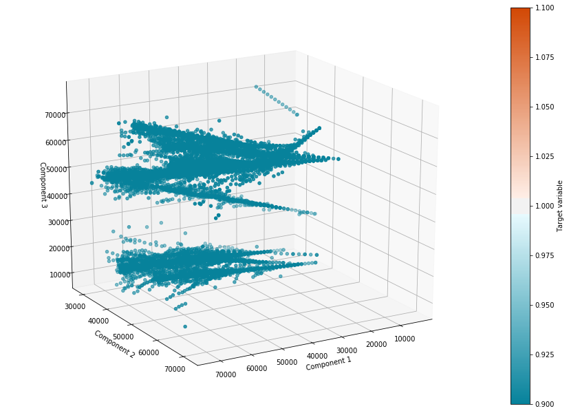
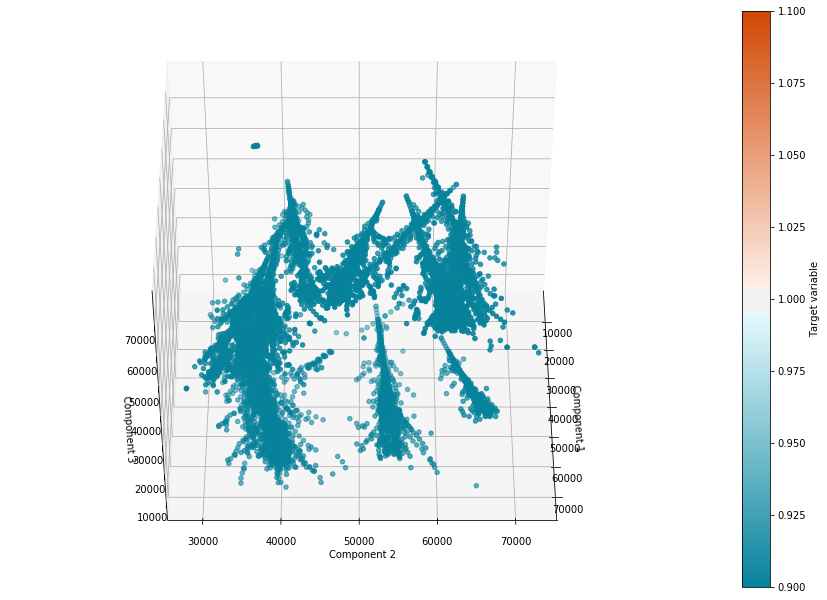
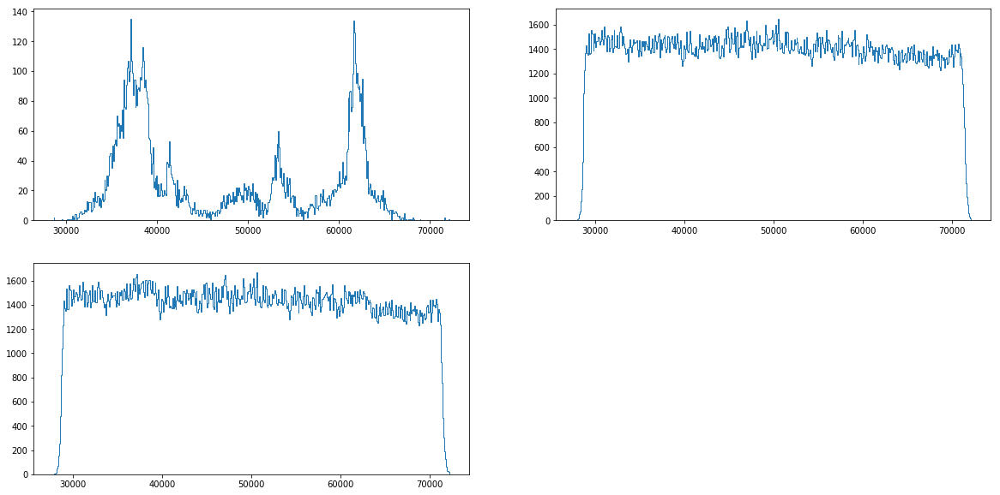
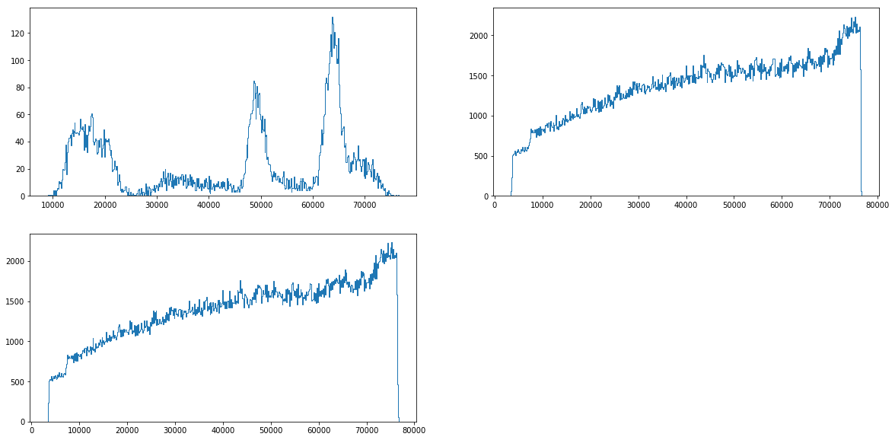
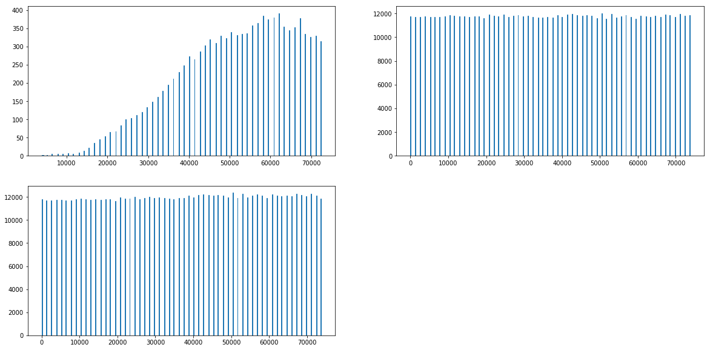

```python
# Sample solution is based on nontebooks by Artem Borzov

import numpy as np
import pandas as pd
import seaborn as sns
import scipy
import tables as tb
from mpl_toolkits.mplot3d import Axes3D
from tqdm import tqdm
from sklearn.neighbors import BallTree, KDTree, DistanceMetric
import glob

%pylab inline
```

    Populating the interactive namespace from numpy and matplotlib


# Load Datasets


```python
train = pd.read_hdf('open30.h5') # pick just a single brick
test = pd.read_hdf('test.h5')
```


```python
test = test.reset_index(drop=True)
```


```python
test.head()
```


<div>
<style scoped>
    .dataframe tbody tr th:only-of-type {
        vertical-align: middle;
    }

    .dataframe tbody tr th {
        vertical-align: top;
    }

    .dataframe thead th {
        text-align: right;
    }
</style>
<table border="1" class="dataframe">
  <thead>
    <tr style="text-align: right;">
      <th></th>
      <th>TX</th>
      <th>TY</th>
      <th>X</th>
      <th>Y</th>
      <th>Z</th>
      <th>data_ind</th>
    </tr>
  </thead>
  <tbody>
    <tr>
      <th>0</th>
      <td>0.087240</td>
      <td>0.119438</td>
      <td>86536.218750</td>
      <td>62988.312500</td>
      <td>56892.0</td>
      <td>0</td>
    </tr>
    <tr>
      <th>1</th>
      <td>-0.380208</td>
      <td>0.198382</td>
      <td>93346.765625</td>
      <td>58062.937500</td>
      <td>14223.0</td>
      <td>0</td>
    </tr>
    <tr>
      <th>2</th>
      <td>-0.348549</td>
      <td>-0.099981</td>
      <td>66129.578125</td>
      <td>23038.673828</td>
      <td>46548.0</td>
      <td>0</td>
    </tr>
    <tr>
      <th>3</th>
      <td>0.585342</td>
      <td>-0.126879</td>
      <td>68825.523438</td>
      <td>55186.625000</td>
      <td>45255.0</td>
      <td>0</td>
    </tr>
    <tr>
      <th>4</th>
      <td>0.038579</td>
      <td>-0.131510</td>
      <td>36366.941406</td>
      <td>47564.878906</td>
      <td>9051.0</td>
      <td>0</td>
    </tr>
  </tbody>
</table>
</div>


```python
train.head()
```


<div>
<style scoped>
    .dataframe tbody tr th:only-of-type {
        vertical-align: middle;
    }

    .dataframe tbody tr th {
        vertical-align: top;
    }

    .dataframe thead th {
        text-align: right;
    }
</style>
<table border="1" class="dataframe">
  <thead>
    <tr style="text-align: right;">
      <th></th>
      <th>TX</th>
      <th>TY</th>
      <th>X</th>
      <th>Y</th>
      <th>Z</th>
      <th>event_id</th>
      <th>signal</th>
      <th>data_ind</th>
    </tr>
  </thead>
  <tbody>
    <tr>
      <th>0</th>
      <td>-0.248382</td>
      <td>0.072824</td>
      <td>37014.070312</td>
      <td>38318.898438</td>
      <td>31032.0</td>
      <td>-999.0</td>
      <td>0.0</td>
      <td>21</td>
    </tr>
    <tr>
      <th>1</th>
      <td>0.768548</td>
      <td>0.490205</td>
      <td>46626.425781</td>
      <td>15151.117188</td>
      <td>72408.0</td>
      <td>188918.0</td>
      <td>1.0</td>
      <td>21</td>
    </tr>
    <tr>
      <th>2</th>
      <td>-0.132050</td>
      <td>-0.049405</td>
      <td>54031.640625</td>
      <td>69132.320312</td>
      <td>60771.0</td>
      <td>-999.0</td>
      <td>0.0</td>
      <td>21</td>
    </tr>
    <tr>
      <th>3</th>
      <td>0.260584</td>
      <td>0.207106</td>
      <td>56653.531250</td>
      <td>35025.765625</td>
      <td>43962.0</td>
      <td>-999.0</td>
      <td>0.0</td>
      <td>21</td>
    </tr>
    <tr>
      <th>4</th>
      <td>0.267597</td>
      <td>0.111272</td>
      <td>42231.714844</td>
      <td>47199.027344</td>
      <td>20688.0</td>
      <td>-999.0</td>
      <td>0.0</td>
      <td>21</td>
    </tr>
  </tbody>
</table>
</div>


Let's see how showers look like inside one data_ind


```python
CMAP = sns.diverging_palette(220, 20, s=99, as_cmap=True, n=2500)

def plot3D(X, target, elev=0, azim=0, title=None, sub=111):
    x = X[:, 0]
    y = X[:, 1]
    z = X[:, 2]
    
    fig = plt.figure(figsize=(12, 8))
    ax = Axes3D(fig)
    mappab = ax.scatter(x, y, z, c=target, cmap=CMAP)

    if title is not None:
        ax.set_title(title)
    ax.set_xlabel('Component 1')
    ax.set_ylabel('Component 2')
    ax.set_zlabel('Component 3')

# Этот инструмент позволяет менять точку зрения
    ax.view_init(elev=elev, azim=azim)
    fig.colorbar(mappable=mappab, label='Target variable')
    plt.show()
    
feat_XY = ['TX', 'TY', 'X', 'Y']
```


```python
first = train.loc[train.data_ind == 21, :]
```


```python
plot3D(first.loc[first.signal==1, ['Z', 'X', 'Y']].values,
       first.loc[first.signal==1].signal.values, elev=20, azim=60)
```





```python
plot3D(first.loc[first.signal==1, ['Z', 'X', 'Y']].values,
       first.loc[first.signal==1].signal.values, elev=45, azim=0)
```





## Let's take a look at basetrack distribution along the axis


```python
axis = 'X'

fig = plt.figure(figsize = [20, 10])
fig.add_subplot(221)
plt.hist(first.loc[first.signal == 1, axis], bins=500, histtype='step')
fig.add_subplot(222)
plt.hist(first.loc[first.signal == 0, axis], bins=500, histtype='step')
fig.add_subplot(223)
values_X = plt.hist(first.loc[:, axis], bins=500, histtype='step')
plt.show()
```





```python
axis = 'Y'

fig = plt.figure(figsize = [20, 10])
fig.add_subplot(221)
plt.hist(first.loc[first.signal == 1, axis], bins=500, histtype='step')
fig.add_subplot(222)
plt.hist(first.loc[first.signal == 0, axis], bins=500, histtype='step')
fig.add_subplot(223)
values_X = plt.hist(first.loc[:, axis], bins=500, histtype='step')
plt.show()
```





```python
axis = 'Z'

fig = plt.figure(figsize = [20, 10])
fig.add_subplot(221)
plt.hist(first.loc[first.signal == 1, axis], bins=500, histtype='step')
fig.add_subplot(222)
plt.hist(first.loc[first.signal == 0, axis], bins=500, histtype='step')
fig.add_subplot(223)
values_X = plt.hist(first.loc[:, axis], bins=500, histtype='step')
plt.show()
```





# Let's group close tracks from neighbour plates into pairs


```python
def add_neighbours(df, k, metric='minkowski'):
    res = []
    
    for data_ind in tqdm(np.unique(df.data_ind)):
        ind = df.loc[df.data_ind == data_ind].copy()
        #как будет замечено, 1293 - это расстояние между слайсами по Z
        ind[['TX', 'TY']] *= 1293
        values = np.unique(ind.Z)
        
        for j in range(1, len(values)):
            z, z_next = (ind.loc[ind.Z == values[j-1]].copy(),
                         ind.loc[ind.Z == values[j]].copy())
            
            b_tree = BallTree(z_next[feat_XY], metric=metric)
            d, i = b_tree.query(z[feat_XY], k=min(k, len(z_next)))
            
            for m in range(i.shape[1]):
                data = z_next.iloc[i[:, m]]
                z_copy = z.copy()
                for col in feat_XY + ['Z']:
                    z_copy[col + '_pair'] = data[col].values
                res.append(z_copy)
            
        res.append(z_next)
        
    res = pd.concat(res, sort=True)
    for col in feat_XY + ['Z']:
        res['d' + col] = res[col].values - res[col + '_pair'].values
    return res

def balance_train(df, k):
    data = add_neighbours(df, k=k)
    noise = data.event_id == -999
    signal, not_signal = data.loc[np.logical_not(noise)], data.loc[noise]
    noise_part = not_signal.sample(len(signal))
    return pd.concat([signal, noise_part], sort=True).reset_index(drop=True)
```


```python
train = []
for file in glob.glob('open*.h5')[:5]: # just 5 bricks
    train.append(balance_train(pd.read_hdf(file), k=3))
train = pd.concat(train, sort=True)
```

    100%|██████████████████████████████████████████████████████████████████████████████████| 10/10 [00:32<00:00,  3.22s/it]
    100%|██████████████████████████████████████████████████████████████████████████████████| 10/10 [00:31<00:00,  3.16s/it]
    100%|██████████████████████████████████████████████████████████████████████████████████| 10/10 [00:31<00:00,  3.29s/it]
    100%|██████████████████████████████████████████████████████████████████████████████████| 10/10 [00:32<00:00,  3.26s/it]
    100%|██████████████████████████████████████████████████████████████████████████████████| 10/10 [00:32<00:00,  3.31s/it]


```python
train.head()
```


<div>
<style scoped>
    .dataframe tbody tr th:only-of-type {
        vertical-align: middle;
    }

    .dataframe tbody tr th {
        vertical-align: top;
    }

    .dataframe thead th {
        text-align: right;
    }
</style>
<table border="1" class="dataframe">
  <thead>
    <tr style="text-align: right;">
      <th></th>
      <th>TX</th>
      <th>TX_pair</th>
      <th>TY</th>
      <th>TY_pair</th>
      <th>X</th>
      <th>X_pair</th>
      <th>Y</th>
      <th>Y_pair</th>
      <th>Z</th>
      <th>Z_pair</th>
      <th>dTX</th>
      <th>dTY</th>
      <th>dX</th>
      <th>dY</th>
      <th>dZ</th>
      <th>data_ind</th>
      <th>event_id</th>
      <th>signal</th>
    </tr>
  </thead>
  <tbody>
    <tr>
      <th>0</th>
      <td>-86.840851</td>
      <td>-94.468147</td>
      <td>92.664032</td>
      <td>123.360336</td>
      <td>47257.558594</td>
      <td>47264.585938</td>
      <td>11238.640625</td>
      <td>11231.140625</td>
      <td>5172.000000</td>
      <td>5426.527344</td>
      <td>7.627296</td>
      <td>-30.696304</td>
      <td>-7.027344</td>
      <td>7.500000</td>
      <td>-254.527344</td>
      <td>261</td>
      <td>183825.0</td>
      <td>1.0</td>
    </tr>
    <tr>
      <th>1</th>
      <td>-94.468147</td>
      <td>-89.869354</td>
      <td>123.360336</td>
      <td>99.934273</td>
      <td>47264.585938</td>
      <td>47168.984375</td>
      <td>11231.140625</td>
      <td>11332.085938</td>
      <td>5426.527344</td>
      <td>6465.000000</td>
      <td>-4.598793</td>
      <td>23.426064</td>
      <td>95.601562</td>
      <td>-100.945312</td>
      <td>-1038.472656</td>
      <td>261</td>
      <td>183825.0</td>
      <td>1.0</td>
    </tr>
    <tr>
      <th>2</th>
      <td>-94.468147</td>
      <td>339.412476</td>
      <td>123.360336</td>
      <td>69.291908</td>
      <td>47264.585938</td>
      <td>47322.609375</td>
      <td>11231.140625</td>
      <td>11128.431641</td>
      <td>5426.527344</td>
      <td>6465.000000</td>
      <td>-433.880615</td>
      <td>54.068428</td>
      <td>-58.023438</td>
      <td>102.708984</td>
      <td>-1038.472656</td>
      <td>261</td>
      <td>183825.0</td>
      <td>1.0</td>
    </tr>
    <tr>
      <th>3</th>
      <td>-94.468147</td>
      <td>275.844818</td>
      <td>123.360336</td>
      <td>159.851212</td>
      <td>47264.585938</td>
      <td>46879.843750</td>
      <td>11231.140625</td>
      <td>11431.775391</td>
      <td>5426.527344</td>
      <td>6465.000000</td>
      <td>-370.312958</td>
      <td>-36.490875</td>
      <td>384.742188</td>
      <td>-200.634766</td>
      <td>-1038.472656</td>
      <td>261</td>
      <td>183825.0</td>
      <td>1.0</td>
    </tr>
    <tr>
      <th>4</th>
      <td>-89.869354</td>
      <td>-70.092018</td>
      <td>99.934273</td>
      <td>84.584602</td>
      <td>47168.984375</td>
      <td>47085.210938</td>
      <td>11332.085938</td>
      <td>11426.468750</td>
      <td>6465.000000</td>
      <td>7758.000000</td>
      <td>-19.777336</td>
      <td>15.349670</td>
      <td>83.773438</td>
      <td>-94.382812</td>
      <td>-1293.000000</td>
      <td>261</td>
      <td>183825.0</td>
      <td>1.0</td>
    </tr>
  </tbody>
</table>
</div>


# Building a model


```python
y_train = train.signal
X_train = train.drop(['event_id', 'signal', 'data_ind'], axis=1)
```


```python
# import os

# mingw_path = 'C:\\Program Files\\mingw-w64\\x86_64-7.2.0-posix-seh-rt_v5-rev1\\mingw64\\bin'

# os.environ['PATH'] = mingw_path + ';' + os.environ['PATH']

import xgboost as xg
from xgboost import XGBClassifier
from sklearn.model_selection import StratifiedKFold, GridSearchCV
```


```python
param_grid = {
        'n_estimators':[10, 20], 
        'max_depth':[15],
}

class XGBClassifier_tmp(XGBClassifier):
    def predict(self, X):
        return XGBClassifier.predict_proba(self, X)[:, 1]

clf = GridSearchCV(XGBClassifier_tmp(learning_rate=0.05, subsample=0.8,
                                     colsample_bytree=0.8, n_jobs=20), 
                   param_grid=param_grid, n_jobs=1,
                   scoring='roc_auc',
                   cv=StratifiedKFold(3, shuffle=True, random_state=0),
                   verbose=7)
```


```python
clf.fit(X_train, y_train)
```

    Fitting 3 folds for each of 2 candidates, totalling 6 fits


```python
clf.best_estimator_
```


    XGBClassifier_tmp(base_score=0.5, booster='gbtree', colsample_bylevel=1,
             colsample_bytree=0.8, gamma=0, learning_rate=0.05,
             max_delta_step=0, max_depth=15, min_child_weight=1, missing=None,
             n_estimators=20, n_jobs=20, nthread=None,
             objective='binary:logistic', random_state=0, reg_alpha=0,
             reg_lambda=1, scale_pos_weight=1, seed=None, silent=True,
             subsample=0.8)


```python
xgb_class = clf.best_estimator_
```

# DNN


```python
from sklearn.preprocessing import Normalizer
transformer = Normalizer()
X_train_norm = transformer.fit_transform(X_train.fillna(0))
```


```python
X_train_norm[:5]
```


    array([[-1.25658954e-03, -1.36695674e-03,  1.34085107e-03,
             1.78502756e-03,  6.83818161e-01,  6.83919847e-01,
             1.62623450e-01,  1.62514925e-01,  7.48389810e-02,
             7.85220042e-02,  1.10367189e-04, -4.44176374e-04,
            -1.01685859e-04,  1.08525208e-04, -3.68301780e-03],
           [-1.36555266e-03, -1.29907636e-03,  1.78319414e-03,
             1.44456641e-03,  6.83217406e-01,  6.81835473e-01,
             1.62348002e-01,  1.63807184e-01,  7.84413517e-02,
             9.34526473e-02, -6.64763138e-05,  3.38627637e-04,
             1.38193637e-03, -1.45918119e-03, -1.50112938e-02],
           [-1.36409560e-03,  4.90102824e-03,  1.78129133e-03,
             1.00055721e-03,  6.82488382e-01,  6.83326244e-01,
             1.62174761e-01,  1.60691664e-01,  7.83576518e-02,
             9.33529213e-02, -6.26512384e-03,  7.80734117e-04,
            -8.37843399e-04,  1.48309115e-03, -1.49952760e-02],
           [-1.36906642e-03,  3.99764255e-03,  1.78778241e-03,
             2.31662137e-03,  6.84975386e-01,  6.79399550e-01,
             1.62765726e-01,  1.65673405e-01,  7.86431879e-02,
             9.36931074e-02, -5.36670862e-03, -5.28838893e-04,
             5.57582220e-03, -2.90767127e-03, -1.50499195e-02],
           [-1.29652978e-03, -1.01120549e-03,  1.44173461e-03,
             1.22028752e-03,  6.80498838e-01,  6.79290235e-01,
             1.63486063e-01,  1.64847702e-01,  9.32694450e-02,
             1.11923337e-01, -2.85324233e-04,  2.21447059e-04,
             1.20858499e-03, -1.36164459e-03, -1.86538883e-02]], dtype=float32)


```python
from keras.layers.core import Dense, Activation, Dropout
from keras.models import Sequential
from keras.optimizers import Adam
from keras.utils import np_utils
from keras.callbacks import EarlyStopping, ModelCheckpoint
```


```python
def nn_model(input_dim):
    model = Sequential()
    model.add(Dense(256, input_dim=input_dim))
    model.add(Activation('relu'))
    model.add(Dropout(0.5))
    
    model.add(Dense(128))
    model.add(Activation('relu'))
    model.add(Dropout(0.5))
    
    model.add(Dense(64))
    model.add(Activation('relu'))
    model.add(Dropout(0.5))

    model.add(Dense(1))
    model.add(Activation('sigmoid'))

    model.compile(loss='binary_crossentropy', optimizer=Adam())
    return model
```


```python
callbacks = [EarlyStopping(monitor='val_loss', min_delta=0, patience=5, verbose=0, mode='auto'),
            ModelCheckpoint('output/{val_loss:.4f}.hdf5', monitor='val_loss', verbose=2, save_best_only=True, mode='auto')]
```


```python
nn = nn_model(X_train_norm.shape[1])
nn.fit(X_train_norm, y_train, validation_split=0.2, epochs=20, verbose=2, batch_size=256, shuffle=True, callbacks=callbacks)
```

    Train on 3868520 samples, validate on 967130 samples
    Epoch 1/20
     - 49s - loss: 0.5739 - val_loss: 0.5724
    
    Epoch 00001: val_loss improved from inf to 0.57244, saving model to output/0.5724.hdf5
    Epoch 2/20
     - 48s - loss: 0.5336 - val_loss: 0.4947
    
    Epoch 00002: val_loss improved from 0.57244 to 0.49468, saving model to output/0.4947.hdf5
    Epoch 3/20
     - 48s - loss: 0.5042 - val_loss: 0.4750
    
    Epoch 00003: val_loss improved from 0.49468 to 0.47498, saving model to output/0.4750.hdf5
    Epoch 4/20
     - 48s - loss: 0.4881 - val_loss: 0.4504
    
    Epoch 00004: val_loss improved from 0.47498 to 0.45044, saving model to output/0.4504.hdf5
    Epoch 5/20
     - 48s - loss: 0.4713 - val_loss: 0.4311
    
    Epoch 00005: val_loss improved from 0.45044 to 0.43106, saving model to output/0.4311.hdf5
    Epoch 6/20
     - 48s - loss: 0.4608 - val_loss: 0.4223
    
    Epoch 00006: val_loss improved from 0.43106 to 0.42234, saving model to output/0.4223.hdf5
    Epoch 7/20
     - 48s - loss: 0.4532 - val_loss: 0.4186
    
    Epoch 00007: val_loss improved from 0.42234 to 0.41856, saving model to output/0.4186.hdf5
    Epoch 8/20
     - 48s - loss: 0.4453 - val_loss: 0.4128
    
    Epoch 00008: val_loss improved from 0.41856 to 0.41282, saving model to output/0.4128.hdf5
    Epoch 9/20
     - 48s - loss: 0.4395 - val_loss: 0.4143
    
    Epoch 00009: val_loss did not improve from 0.41282
    Epoch 10/20
     - 49s - loss: 0.4356 - val_loss: 0.4143
    
    Epoch 00010: val_loss did not improve from 0.41282
    Epoch 11/20
     - 48s - loss: 0.4322 - val_loss: 0.4152
    
    Epoch 00011: val_loss did not improve from 0.41282
    Epoch 12/20
     - 48s - loss: 0.4298 - val_loss: 0.4208
    
    Epoch 00012: val_loss did not improve from 0.41282
    Epoch 13/20
     - 48s - loss: 0.4278 - val_loss: 0.4091
    
    Epoch 00013: val_loss improved from 0.41282 to 0.40912, saving model to output/0.4091.hdf5
    Epoch 14/20
     - 48s - loss: 0.4260 - val_loss: 0.4101
    
    Epoch 00014: val_loss did not improve from 0.40912
    Epoch 15/20
     - 48s - loss: 0.4243 - val_loss: 0.4098
    
    Epoch 00015: val_loss did not improve from 0.40912
    Epoch 16/20
     - 48s - loss: 0.4233 - val_loss: 0.4185
    
    Epoch 00016: val_loss did not improve from 0.40912
    Epoch 17/20
     - 48s - loss: 0.4224 - val_loss: 0.4149
    
    Epoch 00017: val_loss did not improve from 0.40912
    Epoch 18/20
     - 48s - loss: 0.4216 - val_loss: 0.4165
    
    Epoch 00018: val_loss did not improve from 0.40912


    <keras.callbacks.History at 0x1568c571710>


```python
nn.load_weights('output/0.4091.hdf5')
```

# Prediction


```python
prepared_test = add_neighbours(test, k=3)
X_test = prepared_test.drop(['data_ind'], axis=1)
```

    100%|██████████████████████████████████████████████████████████████████████████████████| 11/11 [00:28<00:00,  2.57s/it]


```python
X_test_norm = transformer.transform(X_test.fillna(0))
```


```python
X_test_norm[:5]
```


    array([[-0.00300835, -0.00545834,  0.00972185,  0.00681656,  0.59126395,
             0.59333384,  0.3890069 ,  0.3820696 ,  0.        ,  0.02014557,
             0.00245   ,  0.00290529, -0.00206989,  0.00693733, -0.02014557],
           [-0.00252528, -0.00426304, -0.00411378,  0.00513677,  0.44063714,
             0.4414619 ,  0.5499566 ,  0.55488485,  0.        ,  0.01448405,
             0.00173776, -0.00925055, -0.00082474, -0.00492826, -0.01448405],
           [-0.00225754, -0.00130645,  0.00582741,  0.00499869,  0.40678105,
             0.4056811 ,  0.5793259 ,  0.57797784,  0.        ,  0.0101163 ,
            -0.00095108,  0.00082872,  0.00109993,  0.00134809, -0.0101163 ],
           [-0.00126105, -0.00467851, -0.00375272,  0.00103273,  0.2839596 ,
             0.28194952,  0.64870447,  0.6470427 ,  0.        ,  0.0124427 ,
             0.00341746, -0.00478544,  0.00201007,  0.00166179, -0.0124427 ],
           [-0.00162928,  0.00094605,  0.00400398,  0.00541683,  0.4728925 ,
             0.47000167,  0.5251422 ,  0.5286355 ,  0.        ,  0.00903365,
            -0.00257533, -0.00141285,  0.00289081, -0.00349329, -0.00903365]],
          dtype=float32)


```python
probas = nn.predict_proba(X_test_norm)
```


```python
print(probas.min())
print(probas.max())
print(probas.mean())
```

    3.839519e-25
    0.99234277
    0.24795933


```python
probas.shape
```


    (20179459, 1)


```python
probas = np.squeeze(probas)
```


```python
df = pd.DataFrame({'id': prepared_test.index, 'signal': probas}).groupby('id')
agg = df.aggregate(('mean')).loc[:, ['signal']]
```


```python
agg.shape
```


    (7698899, 1)


```python
agg.head()
```


<div>
<style scoped>
    .dataframe tbody tr th:only-of-type {
        vertical-align: middle;
    }

    .dataframe tbody tr th {
        vertical-align: top;
    }

    .dataframe thead th {
        text-align: right;
    }
</style>
<table border="1" class="dataframe">
  <thead>
    <tr style="text-align: right;">
      <th></th>
      <th>signal</th>
    </tr>
    <tr>
      <th>id</th>
      <th></th>
    </tr>
  </thead>
  <tbody>
    <tr>
      <th>0</th>
      <td>0.413153</td>
    </tr>
    <tr>
      <th>1</th>
      <td>0.006717</td>
    </tr>
    <tr>
      <th>2</th>
      <td>0.282632</td>
    </tr>
    <tr>
      <th>3</th>
      <td>0.246558</td>
    </tr>
    <tr>
      <th>4</th>
      <td>0.009329</td>
    </tr>
  </tbody>
</table>
</div>


```python
agg.to_csv('submission.csv.gz', index=True, compression='gzip')
```


```python

```
